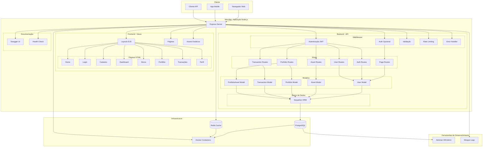

# Arquitetura do Sistema de Investimentos

## Visão Geral

O **Sistema de Investimentos** é uma aplicação **monolítica completa** desenvolvida em **Node.js** que integra frontend e backend em uma única aplicação. O sistema simula uma plataforma de investimentos educacional com interface web moderna, permitindo que usuários gerenciem suas carteiras de investimento através de uma interface visual intuitiva ou através da API REST.

## Objetivos Educacionais

Este projeto foi desenvolvido como material didático para demonstrar:

- **Arquitetura Monolítica Completa**: Frontend e backend em uma única aplicação
- **Interface Web Moderna**: Frontend responsivo com Bootstrap e componentes interativos
- **API RESTful**: Endpoints bem estruturados seguindo padrões REST
- **Autenticação JWT**: Sistema de segurança baseado em tokens
- **ORM Sequelize**: Abstração de banco de dados com relacionamentos
- **Validação de Dados**: Validação robusta de entrada de dados
- **Documentação Swagger**: API autodocumentada
- **Containerização**: Aplicação totalmente dockerizada
- **Transações ACID**: Operações financeiras seguras
- **UX/UI Moderna**: Interface amigável com gráficos e dashboards

## Arquitetura de Alto Nível



## Estrutura de Diretórios

```
sistema-investimentos/
├── src/                          # Código fonte da aplicação
│   ├── config/                   # Configurações
│   │   └── database.js           # Configuração do Sequelize
│   ├── controllers/              # Controladores (futuro)
│   ├── middleware/               # Middlewares customizados
│   │   ├── auth.js              # Autenticação JWT
│   │   └── errorHandler.js      # Tratamento de erros
│   ├── models/                   # Modelos do Sequelize
│   │   ├── index.js             # Configuração dos modelos
│   │   ├── User.js              # Modelo de usuário
│   │   ├── Asset.js             # Modelo de ativo
│   │   ├── Portfolio.js         # Modelo de portfólio
│   │   ├── Transaction.js       # Modelo de transação
│   │   └── PortfolioAsset.js    # Modelo de relacionamento
│   ├── routes/                   # Rotas da aplicação
│   │   ├── pageRoutes.js        # Rotas das páginas (frontend)
│   │   ├── authRoutes.js        # Rotas de autenticação (API)
│   │   ├── userRoutes.js        # Rotas de usuário (API)
│   │   ├── assetRoutes.js       # Rotas de ativos (API)
│   │   ├── portfolioRoutes.js   # Rotas de portfólio (API)
│   │   └── transactionRoutes.js # Rotas de transações (API)
│   ├── views/                    # Templates do frontend
│   │   ├── layout/              # Layouts base
│   │   │   └── base.ejs         # Layout principal com navbar/footer
│   │   ├── pages/               # Páginas da aplicação
│   │   │   ├── home.ejs         # Página inicial
│   │   │   ├── login.ejs        # Página de login
│   │   │   ├── register.ejs     # Página de cadastro
│   │   │   ├── dashboard.ejs    # Dashboard principal
│   │   │   ├── assets.ejs       # Catálogo de ativos
│   │   │   ├── portfolio.ejs    # Portfólio do usuário
│   │   │   ├── transactions.ejs # Histórico de transações
│   │   │   └── profile.ejs      # Perfil do usuário
│   │   └── error.ejs            # Página de erro 404
│   ├── public/                   # Assets estáticos
│   │   ├── css/                 # Estilos CSS
│   │   │   └── app.css          # CSS personalizado da aplicação
│   │   ├── js/                  # JavaScript frontend
│   │   │   └── app.js           # JavaScript principal da aplicação
│   │   └── images/              # Imagens e ícones
│   ├── services/                 # Serviços de negócio (futuro)
│   ├── utils/                    # Utilitários
│   └── app.js                    # Arquivo principal da aplicação
├── docs/                         # Documentação
│   ├── arquitetura-sistema.md    # Este arquivo
│   ├── diagramas-sequencia.md    # Diagramas de sequência
│   ├── modelo-dados.md           # Modelo de dados
│   └── guia-uso.md              # Guia de uso da API
├── sql/                          # Scripts SQL
│   └── init.sql                  # Dados iniciais
├── docker-compose.yml            # Orquestração dos containers
├── Dockerfile                    # Imagem da aplicação
├── package.json                  # Dependências e scripts
├── config.example                # Exemplo de configuração
└── README.md                     # Documentação principal
```

## Componentes Principais

### 1. **Express Server** (`src/app.js`)
- **Responsabilidade**: Servidor HTTP principal que serve tanto frontend quanto API
- **Funcionalidades**:
  - Configuração de middlewares de segurança (Helmet, CORS)
  - Rate limiting para prevenção de ataques
  - Documentação automática com Swagger
  - Health check endpoint
  - Graceful shutdown
  - Renderização de páginas EJS
  - Servir arquivos estáticos (CSS, JS, imagens)

### 2. **Frontend** (`src/views/`, `src/public/`)
- **Template Engine**: EJS para renderização server-side
- **CSS Framework**: Bootstrap 5 para design responsivo
- **JavaScript**: Vanilla JS com classes ES6 e fetch API
- **Funcionalidades**:
  - Layout responsivo com navegação dinâmica
  - Autenticação visual com JWT
  - Dashboard com gráficos Chart.js
  - Formulários com validação client-side
  - Notificações toast em tempo real
  - Modals para ações rápidas

### 3. **Rotas de Páginas** (`src/routes/pageRoutes.js`)
- **Responsabilidade**: Servir páginas HTML para usuários
- **Middleware**: `optionalAuth` para autenticação opcional
- **Páginas**:
  - `/` - Home com overview do sistema
  - `/login` - Autenticação de usuários
  - `/register` - Cadastro de novos usuários
  - `/dashboard` - Dashboard principal (protegido)
  - `/assets` - Catálogo de ativos para investir
  - `/portfolio` - Análise do portfólio pessoal
  - `/transactions` - Histórico de transações
  - `/profile` - Configurações do perfil

### 4. **Modelos de Dados** (`src/models/`)
- **User**: Gerenciamento de usuários e autenticação
- **Asset**: Catálogo de ativos disponíveis para investimento
- **Portfolio**: Carteira individual de cada usuário
- **Transaction**: Histórico de compras e vendas
- **PortfolioAsset**: Posições específicas de ativos no portfólio

### 5. **Sistema de Autenticação** (`src/middleware/auth.js`)
- **JWT (JSON Web Tokens)**: Autenticação stateless
- **Bcrypt**: Hash seguro de senhas
- **Middleware de proteção**: Validação automática de rotas protegidas
- **Middleware opcional**: `optionalAuth` para páginas que funcionam com/sem login

### 6. **API RESTful** (`src/routes/`)
- **Base Path**: `/api/v1/` para todas as rotas da API
- **Endpoints padronizados**: Seguindo convenções REST
- **Validação de entrada**: Express-validator para validação robusta
- **Respostas estruturadas**: Formato consistente de retorno

## Frontend - Interface do Usuário

### Características da Interface

1. **Design Responsivo**
   - Bootstrap 5 com grid system
   - Mobile-first design
   - Compatibilidade cross-browser

2. **Navegação Intuitiva**
   - Navbar fixo com links principais
   - Sidebar para navegação secundária
   - Breadcrumbs para orientação

3. **Dashboard Interativo**
   - Widgets de resumo com métricas
   - Gráficos Chart.js para visualização
   - Tabelas com filtros e paginação

4. **Componentes Modernos**
   - Modals para ações rápidas
   - Tooltips informativos
   - Badges e indicadores visuais
   - Loading states e skeleton screens

### JavaScript Frontend

1. **Classe InvestmentApp** (`src/public/js/app.js`)
   - Gerenciamento centralizado da aplicação
   - Sistema de notificações
   - Autenticação JWT no frontend
   - Utilitários para API calls

2. **Funcionalidades**
   - Login/logout automático
   - Validação de formulários
   - Máscaras de entrada (CPF, telefone)
   - Formatação de valores monetários
   - Gráficos interativos

## Segurança

### Medidas Implementadas

1. **Autenticação JWT**
   - Tokens com expiração configurável
   - Verificação automática em rotas protegidas
   - Storage seguro no localStorage
   - Logout automático na expiração

2. **Validação de Dados**
   - Sanitização de entrada
   - Validação de tipos e formatos
   - Prevenção de XSS e CSRF
   - Validação client-side e server-side

3. **Rate Limiting**
   - Limite de requisições por IP
   - Proteção contra ataques de força bruta
   - Configurável por ambiente

4. **Middlewares de Segurança**
   - Helmet para headers de segurança
   - CORS configurado adequadamente
   - Content Security Policy
   - Logs de auditoria

## Banco de Dados

### PostgreSQL
- **Escolha**: Banco relacional robusto e confiável
- **Características**:
  - ACID compliance para transações financeiras
  - Suporte a JSON para dados flexíveis
  - Índices para performance
  - Backup e recuperação

### ORM Sequelize
- **Abstração**: Interface orientada a objetos
- **Migrações**: Controle de versão do schema
- **Validações**: Validação a nível de modelo
- **Relacionamentos**: Associações complexas entre entidades

## Containerização

### Docker Compose
```yaml
services:
  app:        # Aplicação Node.js (Frontend + Backend)
  postgres:   # Banco de dados
  adminer:    # Interface administrativa
```

### Benefícios
- **Isolamento**: Ambiente consistente
- **Portabilidade**: Execução em qualquer ambiente
- **Escalabilidade**: Fácil replicação de instâncias
- **Desenvolvimento**: Setup rápido para novos desenvolvedores

## Performance

### Otimizações Implementadas

1. **Frontend**
   - CSS e JS minificados
   - Lazy loading de imagens
   - Cache de assets estáticos
   - Componentes reutilizáveis

2. **Backend**
   - Índices de banco otimizados
   - Pool de conexões configurado
   - Cache de sessões
   - Compressão gzip

3. **UX/UI**
   - Loading states visuais
   - Feedback imediato de ações
   - Validação em tempo real
   - Navegação fluida SPA-like

## Fluxos Principais

### 1. Acesso ao Sistema
```
Usuário → Home Page → Login/Register → Dashboard → Funcionalidades
```

### 2. Navegação com Autenticação
```
Página → Verificar Token → Mostrar/Esconder Elementos → Carregar Dados
```

### 3. Operação de Investimento
```
Usuário → Assets Page → Selecionar Ativo → Modal → Confirmar → API Call → Update UI
```

### 4. Visualização de Dados
```
Dashboard → Carregar Dados → Renderizar Gráficos → Atualizar Widgets → Cache Local
```

## Deploy e Produção

### Considerações para Produção

1. **Assets Estáticos**
   - CDN para CSS/JS externos
   - Versionamento de assets
   - Compressão e minificação

2. **SEO e Performance**
   - Meta tags otimizadas
   - Server-side rendering
   - Preload de recursos críticos

3. **Monitoramento**
   - Logs estruturados
   - Métricas de UX
   - Error tracking frontend

4. **Segurança Web**
   - HTTPS obrigatório
   - CSP headers
   - Validação de input

## Recursos Educacionais

Este projeto demonstra conceitos importantes de:

- **Arquitetura Monolítica**: Frontend e backend integrados
- **Full-Stack Development**: JavaScript end-to-end
- **Template Engines**: Server-side rendering com EJS
- **Responsive Design**: Bootstrap e CSS Grid/Flexbox
- **Modern JavaScript**: ES6+, Fetch API, Classes
- **UX/UI Design**: Interfaces modernas e intuitivas
- **APIs RESTful**: Design e implementação
- **Segurança Web**: Autenticação e proteção
- **DevOps**: Containerização e deploy

## Futuras Evoluções

### Frontend
- Migração para SPA (React/Vue)
- PWA com service workers
- Notificações push
- Tema escuro/claro

### Backend
- Microserviços gradual
- Cache Redis avançado
- WebSockets para real-time
- API GraphQL

### Integração
- APIs externas de cotações
- Gateways de pagamento
- Analytics avançado
- Machine learning