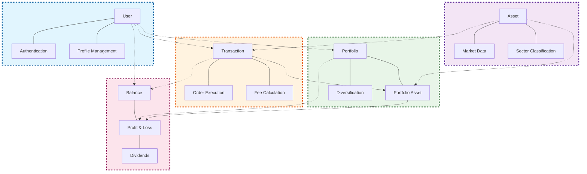

# Bounded Contexts - Domain-Driven Design
## Sistema de Investimentos

### Visão Geral dos Bounded Contexts

### Diagrama de Bounded Contexts



## 1. Identity & Access Management Context

**Linguagem Ubíqua:**
- **User (Usuário)**: Investidor que utiliza a plataforma
- **Authentication (Autenticação)**: Processo de verificação de identidade
- **Profile Management (Gestão de Perfil)**: Gerenciamento de dados pessoais e perfil de risco

**Responsabilidades:**
- Autenticação e autorização de usuários
- Gestão de perfis de investidor
- Controle de acesso às funcionalidades
- Definição de perfil de risco (conservador, moderado, arrojado)

**Entidades Principais:**
```
User {
  - id: Integer
  - name: String
  - email: String
  - cpf: String
  - risk_profile: Enum
  - is_active: Boolean
}

Authentication {
  - token: JWT
  - expires_at: DateTime
  - refresh_token: String
}
```

## 2. Asset Management Context

**Linguagem Ubíqua:**
- **Asset (Ativo)**: Instrumento financeiro negociável
- **Market Data (Dados de Mercado)**: Informações de preço e volume
- **Sector (Setor)**: Classificação econômica do ativo

**Responsabilidades:**
- Catálogo de ativos financeiros
- Gestão de dados de mercado
- Classificação por tipo e setor
- Controle de status de negociação

**Entidades Principais:**
```
Asset {
  - id: Integer
  - symbol: String
  - name: String
  - type: Enum (acao, fii, cripto, renda_fixa)
  - sector: String
  - risk_level: Enum
  - is_active: Boolean
}

MarketData {
  - current_price: Decimal
  - previous_price: Decimal
  - volume: Decimal
  - market_cap: Decimal
}
```

## 3. Portfolio Management Context

**Linguagem Ubíqua:**
- **Portfolio (Carteira)**: Conjunto de investimentos de um usuário
- **Portfolio Asset (Posição)**: Quantidade de um ativo específico na carteira
- **Diversification (Diversificação)**: Distribuição de investimentos

**Responsabilidades:**
- Gestão de carteiras de investimento
- Controle de posições individuais
- Cálculo de diversificação
- Análise de performance

**Entidades Principais:**
```
Portfolio {
  - id: Integer
  - user_id: Integer
  - total_invested: Decimal
  - current_value: Decimal
  - profit_loss: Decimal
}

PortfolioAsset {
  - id: Integer
  - portfolio_id: Integer
  - asset_id: Integer
  - quantity: Decimal
  - average_price: Decimal
  - current_value: Decimal
}
```

## 4. Transaction Processing Context

**Linguagem Ubíqua:**
- **Transaction (Transação)**: Operação de compra, venda ou dividendo
- **Order Execution (Execução de Ordem)**: Processamento da transação
- **Fee Calculation (Cálculo de Taxa)**: Determinação de custos operacionais

**Responsabilidades:**
- Processamento de ordens de compra/venda
- Validação de saldo e regras de negócio
- Cálculo de taxas e comissões
- Controle de status das transações

**Entidades Principais:**
```
Transaction {
  - id: Integer
  - user_id: Integer
  - asset_id: Integer
  - type: Enum (buy, sell, dividend)
  - quantity: Decimal
  - price: Decimal
  - fees: Decimal
  - status: Enum
}

OrderExecution {
  - validation_rules: Rules
  - balance_check: Boolean
  - position_update: Action
}
```

## 5. Financial Context

**Linguagem Ubíqua:**
- **Balance (Saldo)**: Recursos financeiros disponíveis
- **Profit & Loss (Lucro e Prejuízo)**: Resultado financeiro dos investimentos
- **Dividends (Dividendos)**: Proventos recebidos

**Responsabilidades:**
- Gestão de saldo dos usuários
- Cálculos de rentabilidade
- Controle de dividendos
- Relatórios financeiros

**Entidades Principais:**
```
Balance {
  - user_id: Integer
  - available_balance: Decimal
  - reserved_balance: Decimal
  - total_balance: Decimal
}

ProfitLoss {
  - portfolio_id: Integer
  - realized_pnl: Decimal
  - unrealized_pnl: Decimal
  - total_dividends: Decimal
}
```

## Relacionamentos entre Contextos

### Integrações Principais:

1. **IAM → Portfolio Management**
   - Usuário possui carteiras de investimento
   - Controle de acesso às carteiras

2. **Asset Management → Transaction Processing**
   - Ativos são negociados através de transações
   - Validação de ativos ativos para negociação

3. **Transaction Processing → Portfolio Management**
   - Transações atualizam posições nas carteiras
   - Recálculo de valores e médias

4. **Portfolio Management → Financial Context**
   - Carteiras geram cálculos de P&L
   - Posições contribuem para o resultado financeiro

5. **Transaction Processing → Financial Context**
   - Transações afetam o saldo do usuário
   - Taxas são debitadas do saldo

## Benefícios da Separação em Bounded Contexts

### Vantagens:
- **Coesão Alta**: Cada contexto tem responsabilidades bem definidas
- **Acoplamento Baixo**: Redução de dependências entre domínios
- **Linguagem Ubíqua**: Terminologia específica para cada domínio
- **Evolução Independente**: Cada contexto pode evoluir separadamente
- **Testabilidade**: Facilita testes unitários e de integração

### Preparação para Microservices:
Esta estrutura de bounded contexts serve como base para a futura refatoração em microservices, onde cada contexto pode se tornar um ou mais serviços independentes, com suas próprias bases de dados e APIs. 