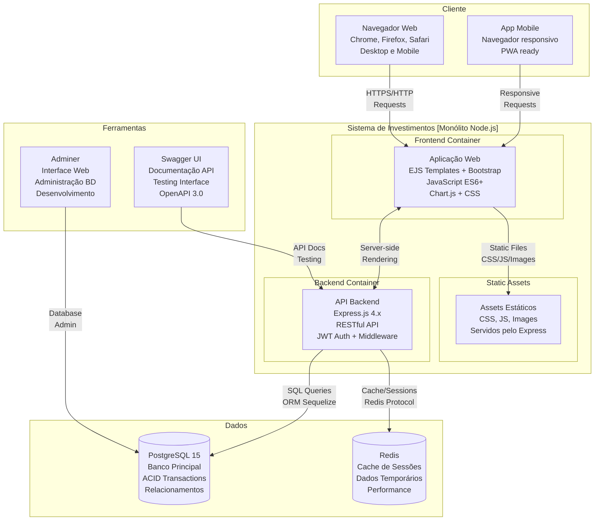
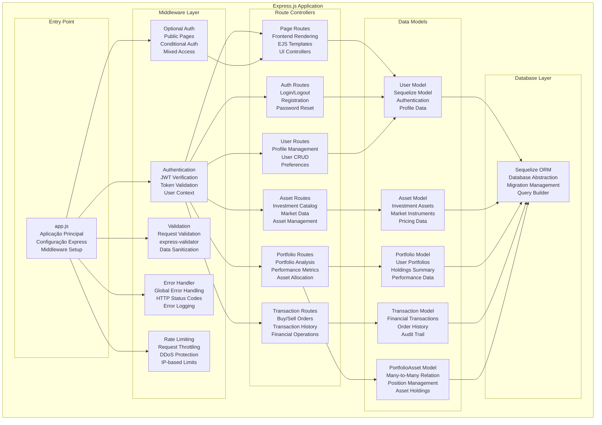
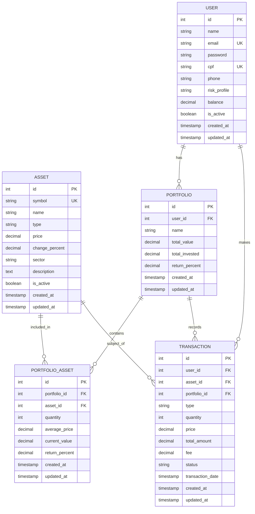
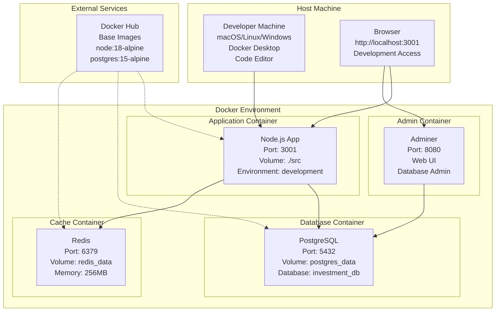
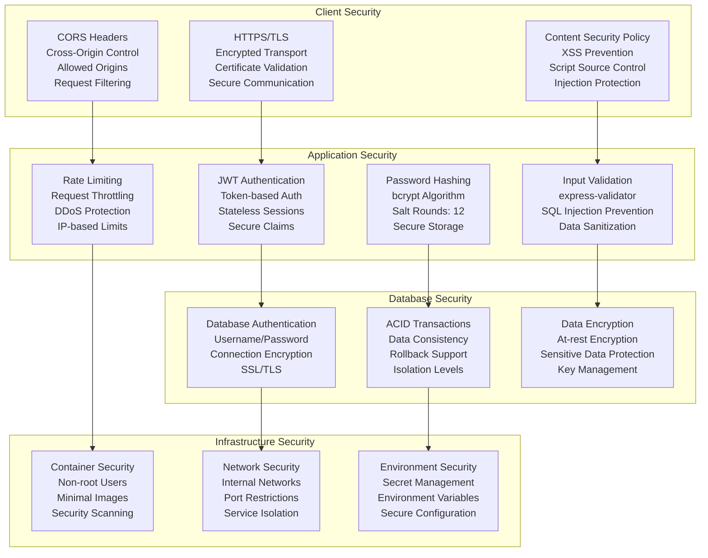
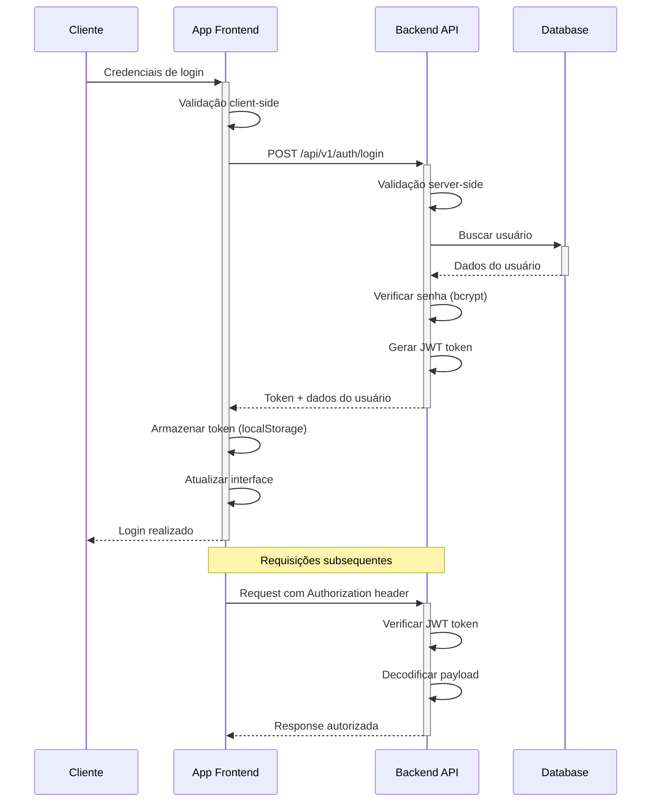
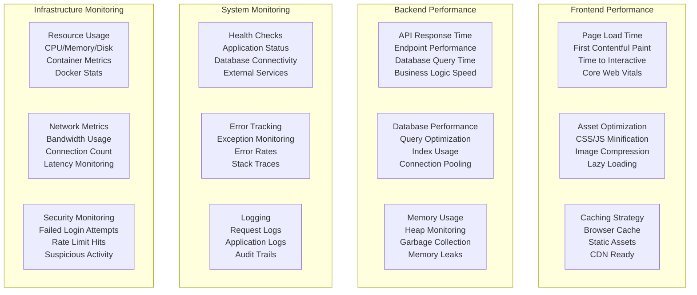
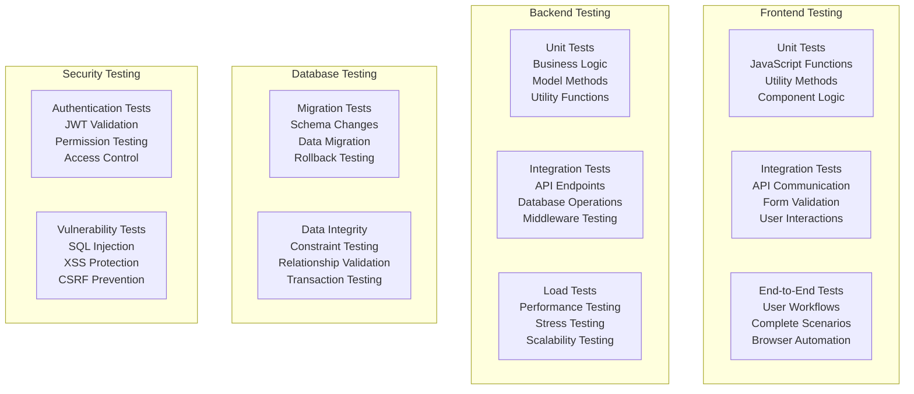
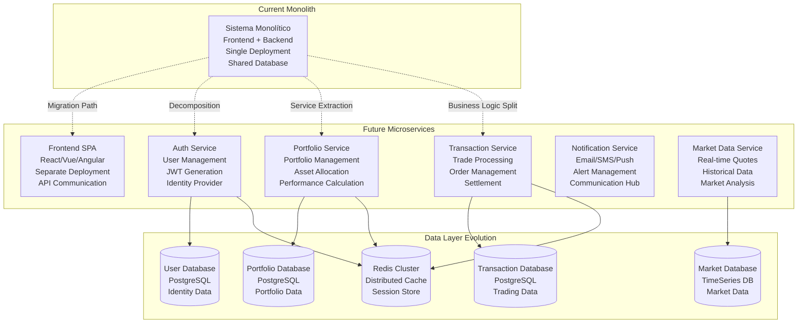

# C4 Model - Arquitetura Completa do Sistema de Investimentos

## Visão Geral

Este documento apresenta a arquitetura completa do **Sistema de Investimentos** usando o modelo C4 (Context, Containers, Components, Code), fornecendo uma visão hierárquica e detalhada de todos os aspectos do sistema.

---

## C4 Level 1 - System Context Diagram

### Contexto do Sistema

```mermaid
graph TB
    subgraph "Usuários"
        INVESTOR[Investidor<br/>Pessoa física interessada<br/>em investimentos]
        ADMIN[Administrador<br/>Gestor do sistema<br/>e monitoramento]
        MOBILE_USER[Usuário Mobile<br/>Acesso via dispositivos<br/>móveis]
    end
    
    subgraph "Sistema de Investimentos"
        SYSTEM[Sistema de Investimentos<br/>Plataforma educacional completa<br/>para gestão de investimentos<br/>com frontend e backend integrados]
    end
    
    subgraph "Sistemas Externos"
        MARKET_API[APIs de Mercado<br/>Cotações em tempo real<br/>e dados históricos<br/>(Simulado)]
        PAYMENT_GW[Gateway de Pagamento<br/>Processamento de<br/>transações financeiras<br/>(Futuro)]
        EMAIL_SVC[Serviço de Email<br/>Notificações e<br/>comunicações<br/>(Futuro)]
    end
    
    INVESTOR -->|"Acessa via navegador<br/>Gestão de portfólio<br/>Análises e transações"| SYSTEM
    ADMIN -->|"Administração<br/>Monitoramento<br/>Configurações"| SYSTEM
    MOBILE_USER -->|"Acesso responsivo<br/>Consultas rápidas<br/>Notificações"| SYSTEM
    
    SYSTEM -.->|"Busca cotações<br/>e dados de mercado<br/>(Mock Data)"| MARKET_API
    SYSTEM -.->|"Processar pagamentos<br/>e transferências<br/>(Futuro)"| PAYMENT_GW
    SYSTEM -.->|"Enviar notificações<br/>e alertas<br/>(Futuro)"| EMAIL_SVC
```

### Descrição do Sistema
- **Nome**: Sistema de Investimentos
- **Tipo**: Aplicação Monolítica Web
- **Propósito**: Plataforma educacional para gestão de investimentos
- **Tecnologia**: Node.js + Express.js + PostgreSQL
- **Usuários**: Investidores individuais, administradores, usuários mobile

---

## C4 Level 2 - Container Diagram

### Containers e Tecnologias



### Detalhes dos Containers

| Container | Tecnologia | Porta | Responsabilidade |
|-----------|------------|-------|------------------|
| **Web App** | EJS + Bootstrap + JS | 3001 | Interface do usuário, templates |
| **API Backend** | Express.js + JWT | 3001 | Lógica de negócio, endpoints |
| **PostgreSQL** | PostgreSQL 15 | 5432 | Persistência de dados |
| **Redis** | Redis 7 | 6379 | Cache e sessões |
| **Adminer** | PHP + Web UI | 8080 | Administração DB |
| **Swagger** | OpenAPI 3.0 | 3001/api-docs | Documentação API |

---

## C4 Level 3 - Component Diagram

### Componentes do Backend API



### Componentes do Frontend

```mermaid
graph TB
    subgraph "Frontend Components"
        subgraph "Templates (EJS)"
            BASE_LAYOUT[base.ejs<br/>Layout Principal<br/>Navbar + Footer<br/>Common Structure]
            HOME_PAGE[home.ejs<br/>Landing Page<br/>System Overview<br/>Marketing Content]
            LOGIN_PAGE[login.ejs<br/>Authentication Form<br/>User Login<br/>Demo Credentials]
            REGISTER_PAGE[register.ejs<br/>Registration Form<br/>User Signup<br/>Validation]
            DASHBOARD_PAGE[dashboard.ejs<br/>Main Dashboard<br/>Widgets + Charts<br/>Portfolio Summary]
            ASSETS_PAGE[assets.ejs<br/>Asset Catalog<br/>Investment Options<br/>Search + Filters]
            PORTFOLIO_PAGE[portfolio.ejs<br/>Portfolio Analysis<br/>Performance Charts<br/>Holdings Detail]
            TRANSACTIONS_PAGE[transactions.ejs<br/>Transaction History<br/>New Transactions<br/>Filters + Pagination]
            PROFILE_PAGE[profile.ejs<br/>User Profile<br/>Settings + Security<br/>Preferences]
            ERROR_PAGE[error.ejs<br/>Error Page<br/>404 Handler<br/>User Friendly]
        end
        
        subgraph "Static Assets"
            APP_CSS[app.css<br/>Custom Styles<br/>263 linhas<br/>Responsive Design]
            APP_JS[app.js<br/>Frontend Logic<br/>302 linhas<br/>ES6+ Classes]
            IMAGES[Images<br/>Icons + Graphics<br/>Brand Assets<br/>UI Elements]
        end
        
        subgraph "JavaScript Modules"
            INVESTMENT_APP[InvestmentApp Class<br/>Main Application<br/>Authentication<br/>API Communication]
            NOTIFICATION_MGR[NotificationManager<br/>Toast Notifications<br/>User Feedback<br/>Alert System]
            UTILS[Utils<br/>Helper Functions<br/>Formatting<br/>Validation]
            CHART_MGR[Chart Manager<br/>Chart.js Integration<br/>Data Visualization<br/>Performance Graphs]
        end
        
        subgraph "External Libraries"
            BOOTSTRAP[Bootstrap 5.3<br/>CSS Framework<br/>Responsive Grid<br/>Components]
            CHARTJS[Chart.js<br/>Charting Library<br/>Data Visualization<br/>Interactive Graphs]
            FONTAWESOME[Font Awesome<br/>Icon Library<br/>UI Icons<br/>Visual Elements]
        end
    end
    
    BASE_LAYOUT --> HOME_PAGE
    BASE_LAYOUT --> LOGIN_PAGE
    BASE_LAYOUT --> REGISTER_PAGE
    BASE_LAYOUT --> DASHBOARD_PAGE
    BASE_LAYOUT --> ASSETS_PAGE
    BASE_LAYOUT --> PORTFOLIO_PAGE
    BASE_LAYOUT --> TRANSACTIONS_PAGE
    BASE_LAYOUT --> PROFILE_PAGE
    BASE_LAYOUT --> ERROR_PAGE
    
    APP_JS --> INVESTMENT_APP
    APP_JS --> NOTIFICATION_MGR
    APP_JS --> UTILS
    APP_JS --> CHART_MGR
    
    DASHBOARD_PAGE --> CHART_MGR
    PORTFOLIO_PAGE --> CHART_MGR
    
    APP_CSS --> BOOTSTRAP
    ALL_PAGES --> FONTAWESOME
    CHART_MGR --> CHARTJS
```



---

## Database Schema Diagram

### Modelo de Dados Completo



### Relacionamentos e Constraints

| Relacionamento | Tipo | Descrição |
|----------------|------|-----------|
| User → Portfolio | 1:N | Usuário pode ter múltiplos portfólios |
| User → Transaction | 1:N | Usuário realiza múltiplas transações |
| Portfolio → PortfolioAsset | 1:N | Portfólio contém múltiplos ativos |
| Portfolio → Transaction | 1:N | Transações afetam portfólio específico |
| Asset → PortfolioAsset | 1:N | Ativo pode estar em múltiplos portfólios |
| Asset → Transaction | 1:N | Ativo pode ter múltiplas transações |

---

## API Architecture Overview

### Endpoints por Categoria

```mermaid
graph LR
    subgraph "Sistema Endpoints"
        HEALTH[/health<br/>Health Check<br/>System Status]
        DOCS[/api-docs<br/>Swagger UI<br/>API Documentation]
        ROOT[/<br/>Homepage<br/>Landing Page]
    end
    
    subgraph "Autenticação Endpoints"
        LOGIN[POST /api/v1/auth/login<br/>User Authentication<br/>JWT Token Generation]
        REGISTER[POST /api/v1/auth/register<br/>User Registration<br/>Account Creation]
        LOGOUT[POST /api/v1/auth/logout<br/>User Logout<br/>Token Invalidation]
        ME[GET /api/v1/auth/me<br/>Current User<br/>Profile Information]
        VERIFY[GET /api/v1/auth/verify<br/>Token Verification<br/>Authentication Check]
    end
    
    subgraph "Usuário Endpoints"
        USER_PROFILE[GET /api/v1/users/profile<br/>User Profile<br/>Personal Information]
        UPDATE_PROFILE[PUT /api/v1/users/profile<br/>Update Profile<br/>Edit Information]
        CHANGE_PASSWORD[PUT /api/v1/auth/change-password<br/>Change Password<br/>Security Update]
    end
    
    subgraph "Ativos Endpoints"
        LIST_ASSETS[GET /api/v1/assets<br/>List Assets<br/>Investment Catalog]
        GET_ASSET[GET /api/v1/assets/:id<br/>Asset Details<br/>Specific Information]
        ASSET_HISTORY[GET /api/v1/assets/:id/history<br/>Price History<br/>Historical Data]
    end
    
    subgraph "Portfólio Endpoints"
        GET_PORTFOLIO[GET /api/v1/portfolio<br/>Portfolio Summary<br/>Holdings Overview]
        PORTFOLIO_DETAILED[GET /api/v1/portfolio/detailed<br/>Detailed Analysis<br/>Complete Information]
        PORTFOLIO_PERFORMANCE[GET /api/v1/portfolio/performance<br/>Performance Metrics<br/>Returns Analysis]
    end
    
    subgraph "Transações Endpoints"
        LIST_TRANSACTIONS[GET /api/v1/transactions<br/>Transaction History<br/>Complete List]
        CREATE_TRANSACTION[POST /api/v1/transactions<br/>New Transaction<br/>Buy/Sell Order]
        BUY_ASSET[POST /api/v1/transactions/buy<br/>Buy Asset<br/>Purchase Order]
        SELL_ASSET[POST /api/v1/transactions/sell<br/>Sell Asset<br/>Sale Order]
        GET_TRANSACTION[GET /api/v1/transactions/:id<br/>Transaction Details<br/>Specific Information]
    end
    
    subgraph "Páginas Frontend"
        PAGE_HOME[GET /<br/>Home Page<br/>Landing Interface]
        PAGE_LOGIN[GET /login<br/>Login Page<br/>Authentication Form]
        PAGE_REGISTER[GET /register<br/>Register Page<br/>Signup Form]
        PAGE_DASHBOARD[GET /dashboard<br/>Dashboard Page<br/>Main Interface]
        PAGE_ASSETS[GET /assets<br/>Assets Page<br/>Investment Catalog]
        PAGE_PORTFOLIO[GET /portfolio<br/>Portfolio Page<br/>Holdings Analysis]
        PAGE_TRANSACTIONS[GET /transactions<br/>Transactions Page<br/>History Interface]
        PAGE_PROFILE[GET /profile<br/>Profile Page<br/>User Settings]
    end
```

### API Response Patterns

```json
// Success Response
{
    "success": true,
    "data": { /* payload */ },
    "message": "Operation completed successfully",
    "meta": {
        "timestamp": "2024-01-01T00:00:00.000Z",
        "pagination": { /* if applicable */ }
    }
}

// Error Response
{
    "success": false,
    "error": {
        "code": "VALIDATION_ERROR",
        "message": "Invalid input data",
        "details": [ /* validation errors */ ]
    },
    "meta": {
        "timestamp": "2024-01-01T00:00:00.000Z"
    }
}
```

---

## Deployment Diagram

### Ambiente de Desenvolvimento



### Configuração Docker Compose

```yaml
# docker-compose.yml
version: '3.8'
services:
  app:
    build: .
    ports: ["3001:3001"]
    volumes: ["./src:/app/src"]
    environment:
      - NODE_ENV=development
      - DB_HOST=postgres
      - REDIS_URL=redis://redis:6379
    depends_on: [postgres, redis]
    
  postgres:
    image: postgres:15-alpine
    ports: ["5432:5432"]
    environment:
      POSTGRES_DB: investment_db
      POSTGRES_USER: postgres
      POSTGRES_PASSWORD: postgres
    volumes: ["postgres_data:/var/lib/postgresql/data"]
    
  redis:
    image: redis:7-alpine
    ports: ["6379:6379"]
    volumes: ["redis_data:/data"]
    
  adminer:
    image: adminer
    ports: ["8080:8080"]
    depends_on: [postgres]
```

---

## Security Architecture

### Segurança em Camadas



### Fluxo de Autenticação Segura



---

## Performance & Monitoring

### Métricas e Monitoramento



---

## Testing Strategy

### Estratégia de Testes



---

## Scalability & Future Architecture

### Evolução para Microserviços



---

## Sistema Completo - Resumo Executivo

### Características Principais

| Aspecto | Detalhes |
|---------|----------|
| **Arquitetura** | Monólito completo com frontend e backend integrados |
| **Frontend** | EJS templates + Bootstrap + JavaScript ES6+ |
| **Backend** | Express.js + JWT + Sequelize ORM |
| **Database** | PostgreSQL com relacionamentos ACID |
| **Cache** | Redis para sessões e performance |
| **Security** | JWT auth + bcrypt + validation + rate limiting |
| **API** | RESTful com 19 endpoints documentados |
| **UI/UX** | 8 páginas responsivas com gráficos Chart.js |
| **DevOps** | Docker Compose para desenvolvimento |
| **Docs** | Swagger UI + documentação completa |

### Métricas do Sistema

- **Total de Código**: ~4.000 linhas
- **Páginas Frontend**: 8 páginas completas
- **Endpoints API**: 19 endpoints RESTful
- **Modelos de Dados**: 5 entidades relacionadas
- **Componentes JS**: 4 classes principais
- **Estilos CSS**: 263 linhas customizadas
- **Documentação**: 2.000+ linhas

### Funcionalidades Implementadas

- **Homepage** com overview e call-to-action
- **Sistema de Login/Registro** com validação
- **Dashboard** com widgets e gráficos Chart.js
- **Catálogo de Ativos** com filtros e busca
- **Análise de Portfólio** com métricas avançadas
- **Transações** com histórico e nova transação
- **Perfil do Usuário** com configurações completas
- **API REST** documentada com Swagger
- **Autenticação JWT** integrada frontend/backend
- **Design Responsivo** mobile-friendly
- **Containerização** Docker para desenvolvimento

### Roadmap Futuro

1. **PWA** - Progressive Web App com service workers
2. **Real-time** - WebSockets para dados em tempo real
3. **Microservices** - Decomposição gradual em serviços
4. **Testing** - Suite completa de testes automatizados
5. **CI/CD** - Pipeline de integração contínua
6. **Monitoring** - APM e observabilidade completa
7. **Mobile App** - Aplicativo nativo iOS/Android

O **Sistema de Investimentos** demonstra uma arquitetura sólida e completa, fornecendo uma base educacional robusta para conceitos de desenvolvimento full-stack moderno.