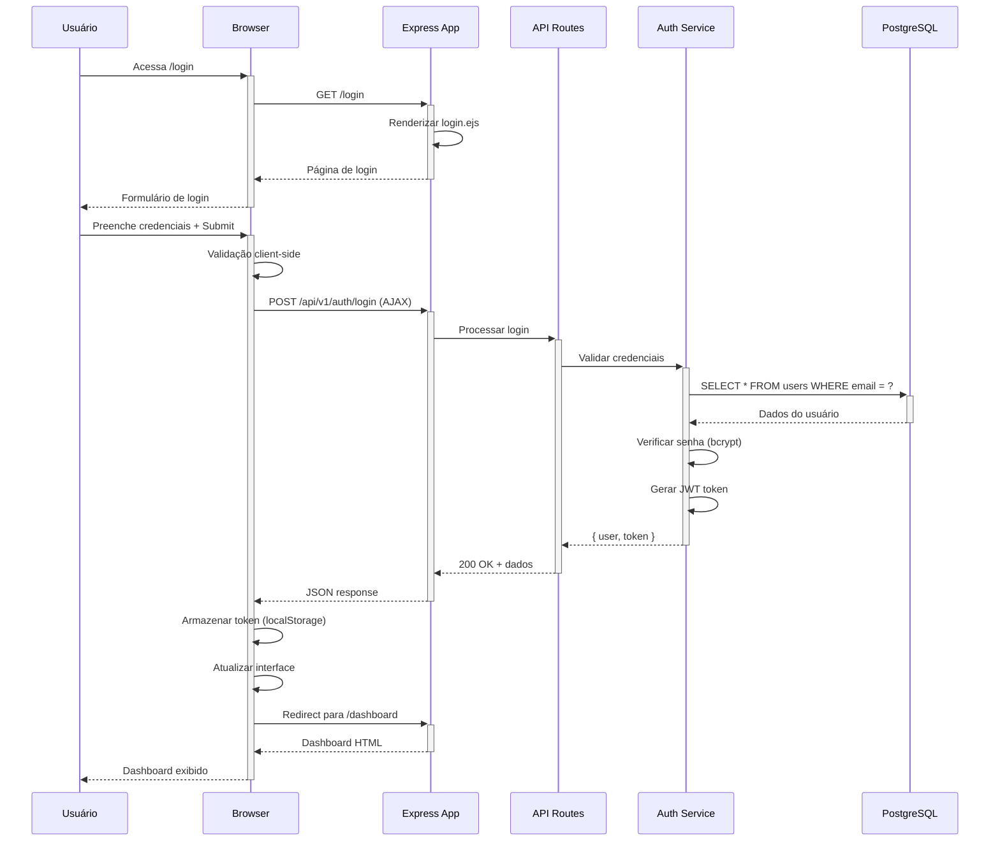
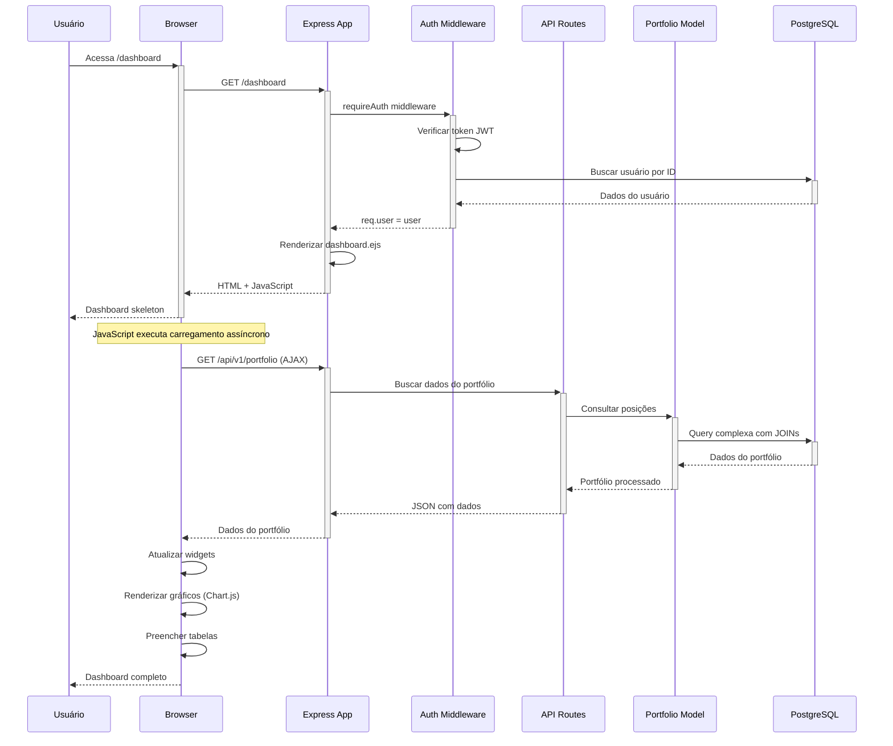
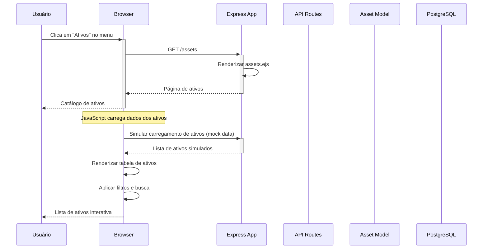
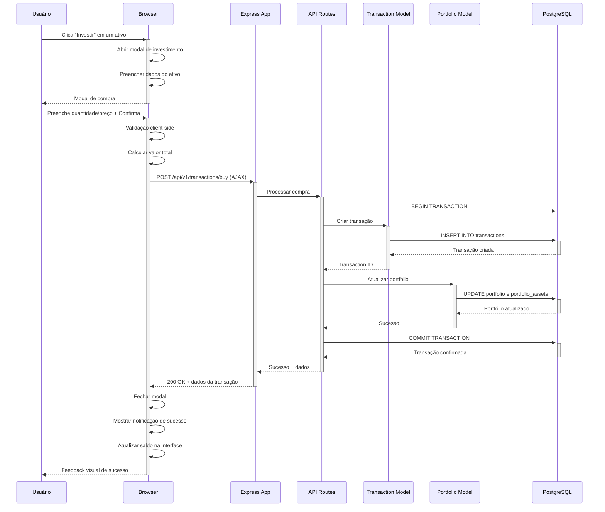
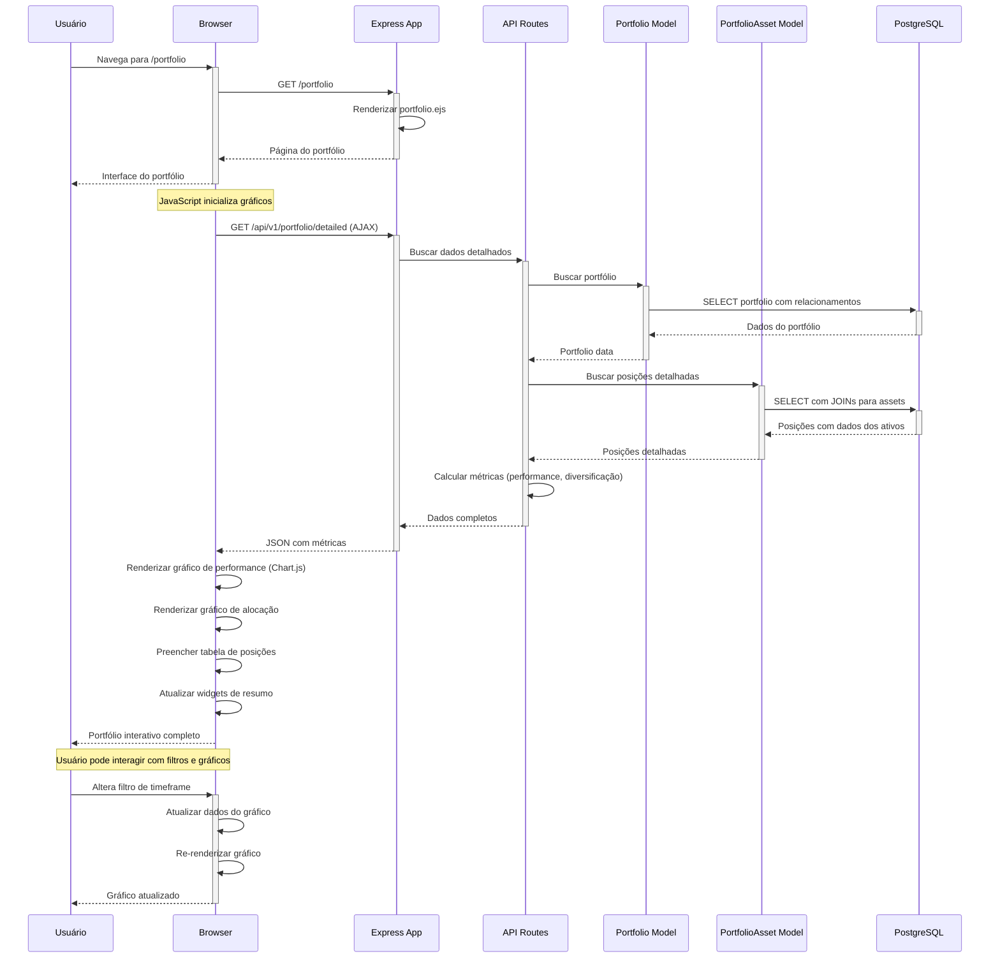
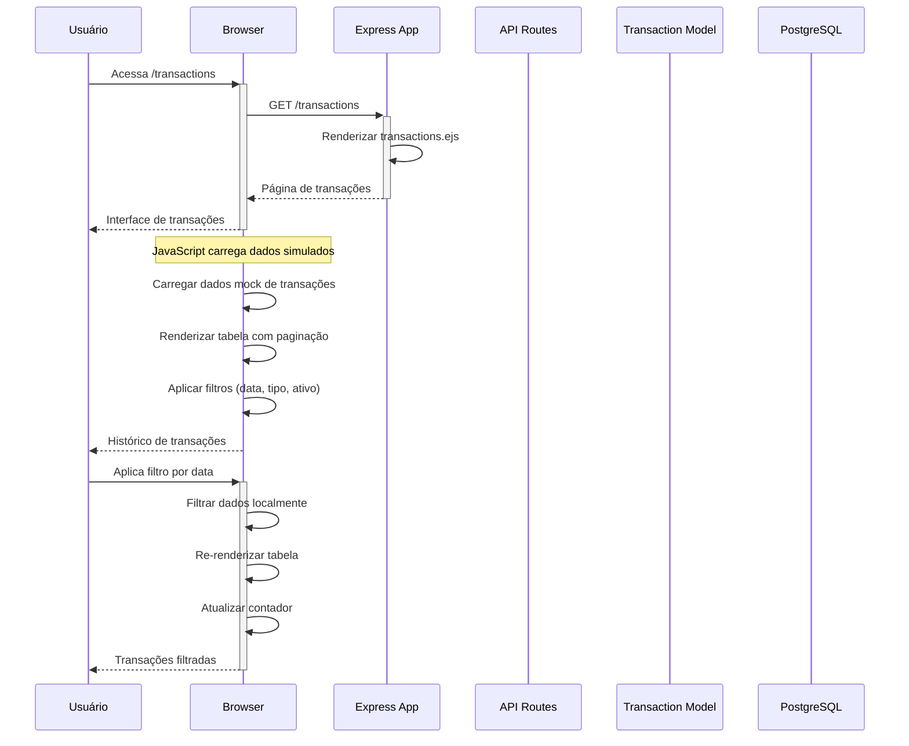
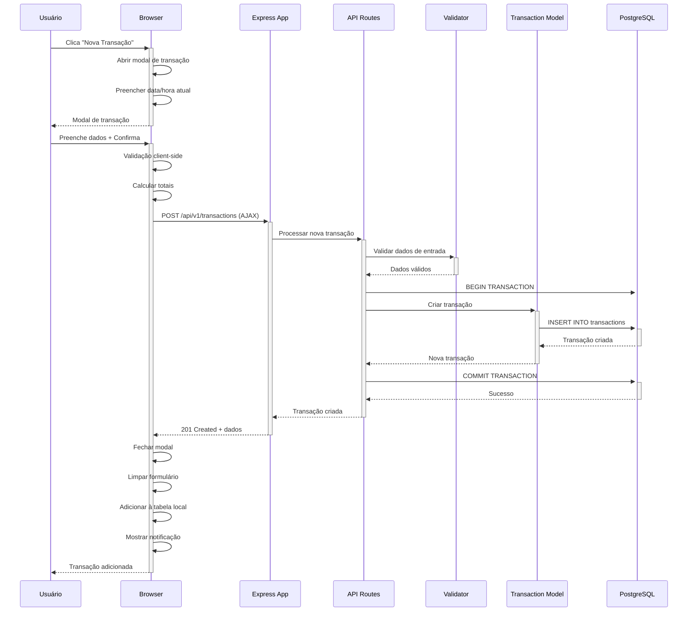
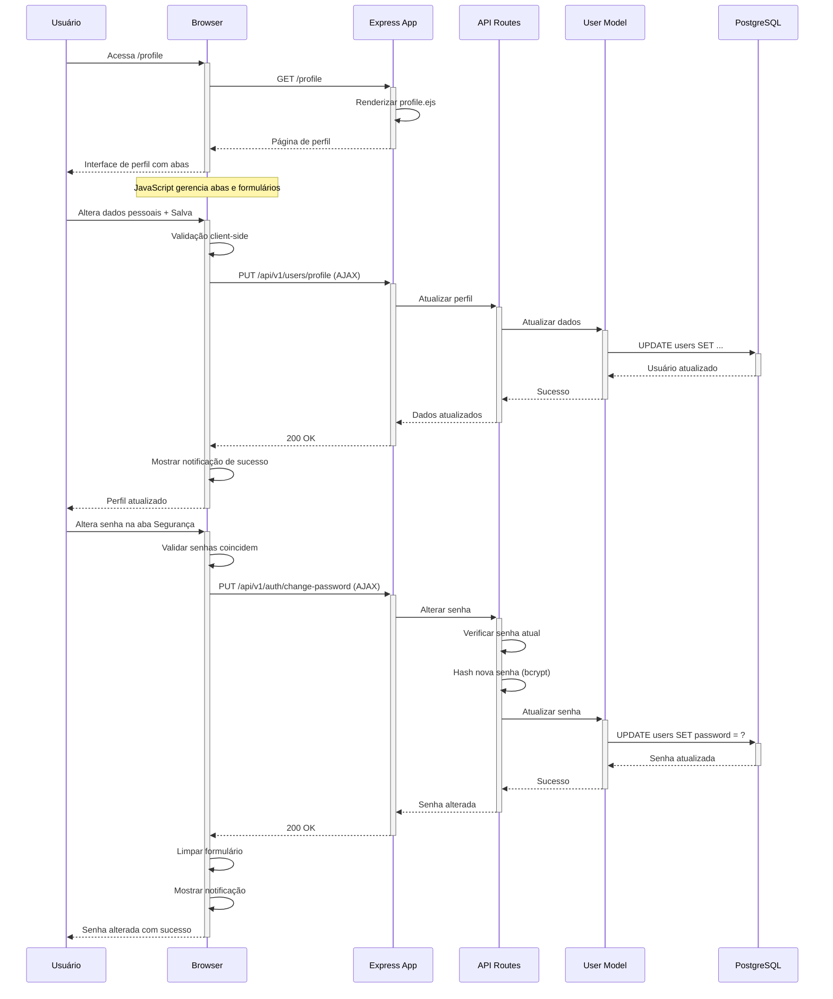
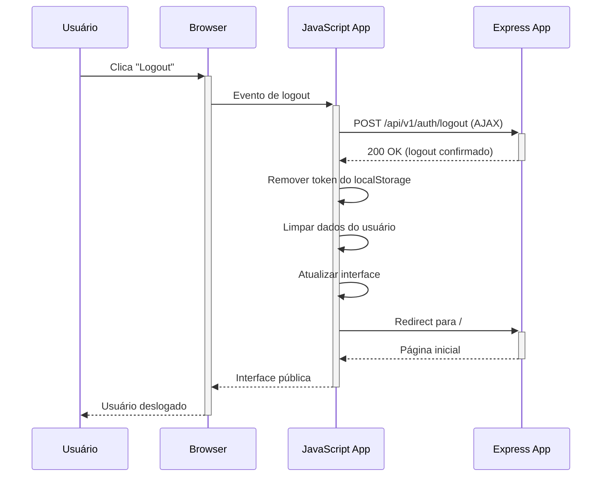
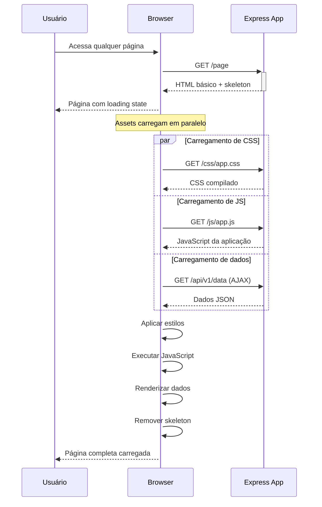

# Diagramas de Sequência - Sistema de Investimentos

## Visão Geral

Este documento apresenta os diagramas de sequência dos principais fluxos do **Sistema de Investimentos**, demonstrando a interação entre frontend, backend e banco de dados em uma aplicação monolítica completa.

---

## 1. Fluxo de Interface Web - Acesso ao Sistema

### 1.1 Acesso à Página Inicial

```mermaid
sequenceDiagram
    participant U as Usuário
    participant B as Browser
    participant APP as Express App
    participant AUTH as Auth Middleware
    participant V as Views (EJS)

    U->>+B: Acessa http://localhost:3001/
    B->>+APP: GET /
    
    APP->>+AUTH: optionalAuth middleware
    AUTH->>AUTH: Verificar token JWT (opcional)
    
    alt Token válido
        AUTH->>AUTH: Decodificar usuário
        AUTH-->>-APP: req.user = user
    else Sem token ou inválido
        AUTH-->>-APP: req.user = null
    end
    
    APP->>+V: Renderizar home.ejs
    V->>V: Compilar template com dados
    V-->>-APP: HTML compilado
    
    APP-->>-B: 200 OK + HTML
    B->>B: Carregar CSS/JS
    B->>B: Executar JavaScript
    B-->>-U: Página inicial exibida
```

### 1.2 Login via Interface Web



---

## 2. Fluxo de Dashboard - Carregamento de Dados



---

## 3. Fluxo de Investimento - Interface Completa

### 3.1 Navegação para Catálogo de Ativos



### 3.2 Compra de Ativo via Modal



---

## 4. Fluxo de Portfólio - Visualização Interativa



---

## 5. Fluxo de Transações - Histórico e Nova Transação

### 5.1 Visualização do Histórico



### 5.2 Criação de Nova Transação



---

## 6. Fluxo de Perfil - Configurações do Usuário



---

## 7. Fluxo de Autenticação Integrada

### 7.1 Verificação Automática de Token

```mermaid
sequenceDiagram
    participant B as Browser
    participant JS as JavaScript App
    participant APP as Express App
    participant API as API Routes
    participant AUTH as Auth Service

    Note over B,JS: A cada carregamento de página

    B->>+JS: Document ready
    JS->>JS: Verificar token no localStorage
    
    alt Token existe
        JS->>+APP: GET /api/v1/auth/verify (AJAX)
        APP->>+API: Verificar token
        API->>+AUTH: Validar JWT
        AUTH-->>-API: Token válido/inválido
        
        alt Token válido
            API-->>-APP: Usuário autenticado
            APP-->>-JS: 200 OK + user data
            JS->>JS: Atualizar interface (mostrar nav logado)
            JS->>JS: Habilitar funcionalidades autenticadas
        else Token inválido
            API-->>-APP: Token inválido
            APP-->>-JS: 401 Unauthorized
            JS->>JS: Remover token do localStorage
            JS->>JS: Atualizar interface (mostrar nav público)
        end
    else Sem token
        JS->>JS: Mostrar interface pública
        JS->>JS: Desabilitar funcionalidades autenticadas
    end
    
    JS-->>-B: Interface atualizada
```

### 7.2 Logout Automático



---

## 8. Responsividade e UX

### 8.1 Carregamento Progressivo



---

## Benefícios da Arquitetura Monolítica Integrada

### Vantagens Demonstradas

1. **Desenvolvimento Simplificado**: Um único codebase para frontend e backend
2. **Deploys Atômicos**: Frontend e backend sempre sincronizados
3. **Compartilhamento de Código**: Validações e utilitários reutilizados
4. **Performance**: Menos latência entre camadas
5. **Debugging Facilitado**: Stack trace completo em um só lugar
6. **SSR Built-in**: Server-side rendering nativo com EJS

### Fluxos Otimizados

- **Cache de Templates**: EJS compila templates uma vez
- **Assets Estáticos**: Servidos diretamente pelo Express
- **Autenticação Unificada**: JWT funciona tanto na API quanto nas páginas
- **Error Handling**: Tratamento centralizado de erros frontend/backend

Estes diagramas demonstram a robustez e a segurança do sistema, essenciais para uma aplicação financeira educacional completa.