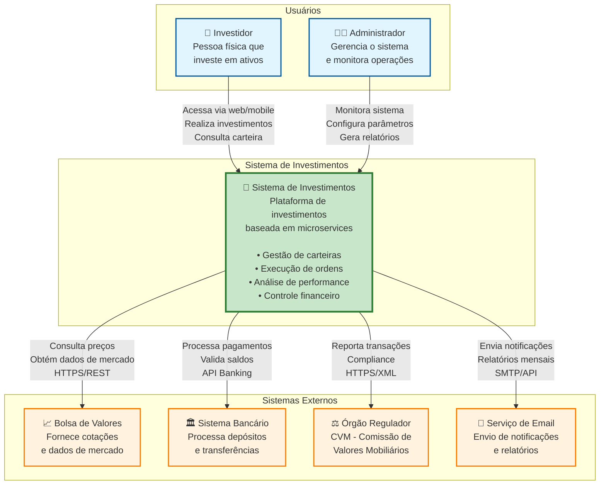
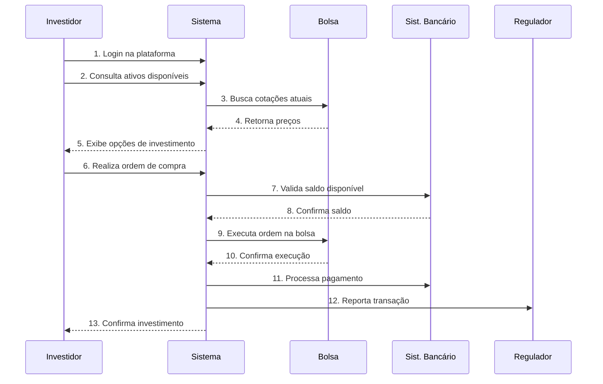
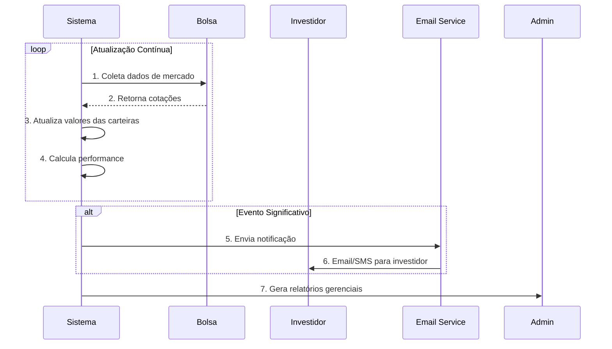

# 00 - Visão Geral do Sistema
## Sistema de Investimentos - Arquitetura de Microservices

### Introdução

O Sistema de Investimentos é uma plataforma completa para gestão de investimentos financeiros, desenvolvida com arquitetura de microservices. O sistema permite que investidores gerenciem suas carteiras, executem transações e acompanhem a performance de seus investimentos.

### Contexto do Sistema

### Atores do Sistema

#### **👤 Investidor**
- **Perfil**: Pessoa física que utiliza a plataforma para investir
- **Objetivos**: 
  - Construir e gerenciar carteiras de investimento
  - Executar ordens de compra e venda
  - Acompanhar performance dos investimentos
  - Receber relatórios e análises
- **Canais de Acesso**: Web browser, aplicativo mobile

#### **👨‍💼 Administrador**
- **Perfil**: Responsável pela operação e gestão do sistema
- **Objetivos**:
  - Monitorar saúde e performance do sistema
  - Configurar parâmetros operacionais
  - Gerar relatórios gerenciais
  - Garantir compliance regulatório
- **Canais de Acesso**: Dashboard administrativo, ferramentas de monitoramento

### Sistemas Externos

#### **📈 Bolsa de Valores**
- **Função**: Fornece dados de mercado em tempo real
- **Dados Fornecidos**:
  - Cotações de ações, fundos e outros ativos
  - Volume de negociação
  - Dados históricos de preços
  - Eventos corporativos
- **Protocolo**: HTTPS/REST API

#### **🏛️ Sistema Bancário**
- **Função**: Processa movimentações financeiras
- **Serviços Oferecidos**:
  - Depósitos e saques
  - Transferências entre contas
  - Validação de saldos
  - Histórico de movimentações
- **Protocolo**: API Banking (Open Banking)

#### **⚖️ Órgão Regulador (CVM)**
- **Função**: Supervisão e compliance
- **Relatórios Enviados**:
  - Transações realizadas
  - Posições dos investidores
  - Movimentações suspeitas
  - Relatórios de compliance
- **Protocolo**: HTTPS/XML

#### **📧 Serviço de Email**
- **Função**: Comunicação com usuários
- **Tipos de Notificação**:
  - Confirmações de transação
  - Relatórios mensais
  - Alertas de mercado
  - Comunicados importantes
- **Protocolo**: SMTP/API

### Fluxos Principais de Negócio

#### **1. Fluxo de Investimento**

#### **2. Fluxo de Monitoramento**

### Benefícios da Arquitetura

#### **🎯 Para o Negócio**
- **Escalabilidade**: Suporte a crescimento de usuários e transações
- **Disponibilidade**: Alta disponibilidade com redundância
- **Compliance**: Facilita atendimento a requisitos regulatórios
- **Time-to-Market**: Deploy rápido de novas funcionalidades

#### **🔧 Para a Tecnologia**
- **Manutenibilidade**: Código organizado por domínio
- **Testabilidade**: Testes isolados por serviço
- **Flexibilidade**: Tecnologias específicas por necessidade
- **Resiliência**: Falhas isoladas não afetam todo o sistema

#### **👥 Para os Usuários**
- **Performance**: Resposta rápida às operações
- **Confiabilidade**: Sistema estável e seguro
- **Funcionalidades**: Recursos avançados de análise
- **Experiência**: Interface intuitiva e responsiva

### Tecnologias Principais

#### **Backend**
- **Runtime**: Node.js 18+
- **Framework**: Express.js
- **Database**: PostgreSQL 14+
- **Authentication**: JWT
- **Documentation**: Swagger/OpenAPI

#### **Arquitetura**
- **Pattern**: Microservices
- **Communication**: HTTP/REST
- **Gateway**: API Gateway centralizado
- **Monitoring**: Health checks e métricas

#### **DevOps**
- **Containerization**: Docker
- **Orchestration**: Docker Compose
- **Process Management**: PM2
- **Automation**: Scripts de deploy

### Próximos Passos

Esta visão geral será detalhada nos próximos documentos:

1. **01 - Arquitetura de Containers**: Decomposição em microservices
2. **02 - Componentes Internos**: Estrutura interna de cada serviço
3. **03 - Implementação de Código**: Detalhes de classes e interfaces

### Glossário

- **API Gateway**: Ponto único de entrada para todas as requisições
- **Microservice**: Serviço independente com responsabilidade específica
- **Container**: Unidade de deployment isolada
- **Compliance**: Conformidade com regulamentações
- **Circuit Breaker**: Padrão para lidar com falhas de serviços externos 