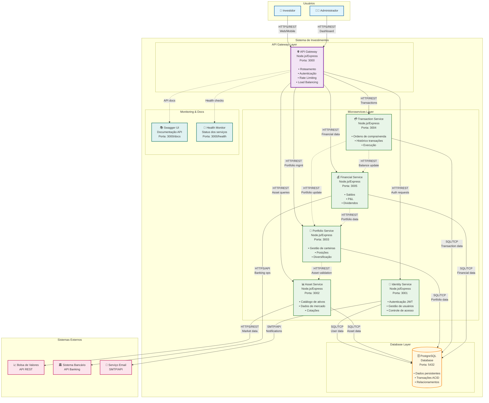
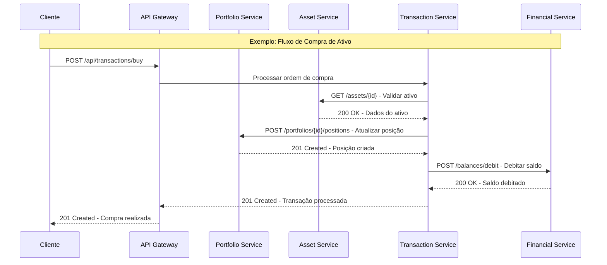

 

### Diagrama de Container

### Descrição dos Containers

#### **API Gateway Layer:**
- **API Gateway**: Ponto único de entrada, gerencia roteamento, autenticação e balanceamento de carga

#### **Microservices Layer:**
- **Identity Service**: Gerencia autenticação, autorização e dados de usuários
- **Asset Service**: Mantém catálogo de ativos e dados de mercado
- **Portfolio Service**: Gerencia carteiras de investimento e posições
- **Transaction Service**: Processa ordens de compra/venda e histórico
- **Financial Service**: Controla saldos, P&L e dividendos

#### **Database Layer:**
- **PostgreSQL**: Banco de dados relacional compartilhado com isolamento por schema

#### **Monitoring & Documentation:**
- **Swagger UI**: Documentação interativa das APIs
- **Health Monitor**: Monitoramento de saúde dos serviços

### Padrões de Comunicação

#### **Comunicação Síncrona (HTTP/REST):**
- Cliente → API Gateway → Microservices
- Microservices entre si para operações críticas
- Microservices → Sistemas externos

#### **Fluxo de Comunicação Inter-Serviços:**

A comunicação direta entre serviços é **limitada e específica** para operações críticas:

#### **Comunicação Assíncrona (Futura implementação):**
- Message Queue para eventos de transação
- Event Sourcing para auditoria
- Pub/Sub para notificações

### Portas e Protocolos

| Container | Porta | Protocolo | Descrição |
|-----------|-------|-----------|-----------|
| API Gateway | 3000 | HTTP/HTTPS | Entrada principal |
| Identity Service | 3001 | HTTP | Autenticação |
| Asset Service | 3002 | HTTP | Dados de ativos |
| Portfolio Service | 3003 | HTTP | Gestão carteiras |
| Transaction Service | 3004 | HTTP | Transações |
| Financial Service | 3005 | HTTP | Dados financeiros |
| PostgreSQL | 5432 | TCP/SQL | Banco de dados |

### Estratégias de Deployment

#### **Desenvolvimento:**
- Cada microservice roda em processo separado
- Banco PostgreSQL local
- Hot reload para desenvolvimento

#### **Produção:**
- Containers Docker independentes
- Kubernetes para orquestração
- Load balancers para alta disponibilidade
- Database clustering

### Padrões de Fluxo Implementados

#### **1. Gateway-Centric Pattern:**
- Todas as requisições externas passam pelo API Gateway
- Autenticação e autorização centralizadas
- Rate limiting e CORS aplicados globalmente
- Roteamento inteligente baseado em paths

#### **2. Service-to-Service Communication:**
- Comunicação direta limitada a operações críticas
- Validação de dados entre serviços relacionados
- Transações distribuídas para consistência
- Timeouts e circuit breakers para resiliência

#### **3. Database per Service:**
- Cada serviço possui seu próprio schema
- Isolamento de dados por contexto de negócio
- Transações locais dentro de cada serviço
- Eventual consistency entre serviços

### Benefícios da Arquitetura

- **Isolamento**: Cada serviço pode ser desenvolvido independentemente
- **Escalabilidade**: Escala horizontal por serviço conforme demanda
- **Tecnologia**: Flexibilidade para usar diferentes tecnologias por serviço
- **Deploy**: Deploy independente reduz riscos
- **Manutenção**: Facilita manutenção e debugging 