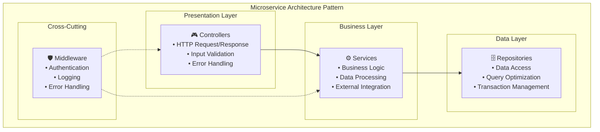
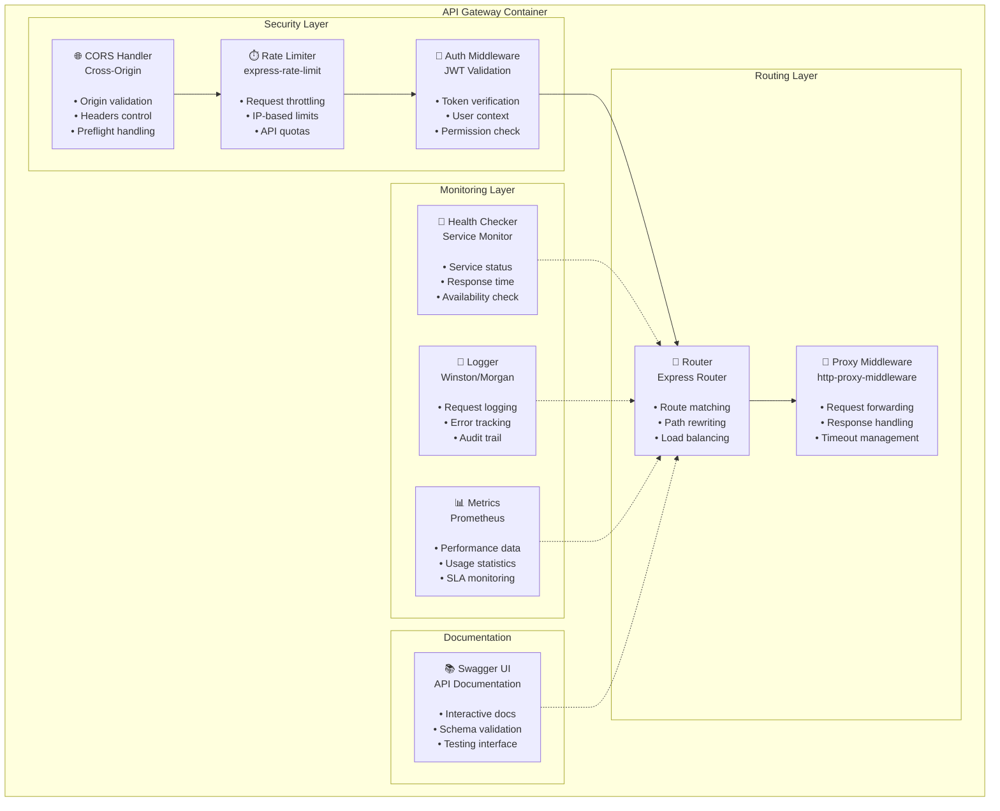
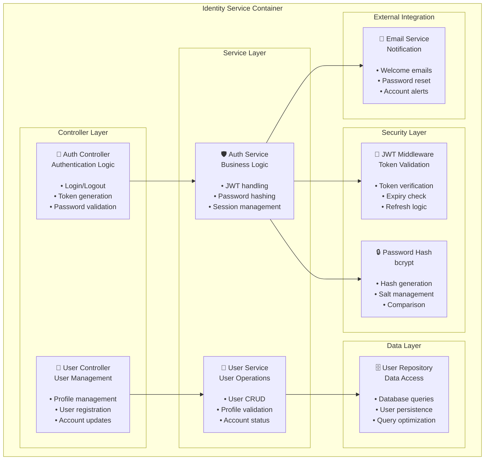
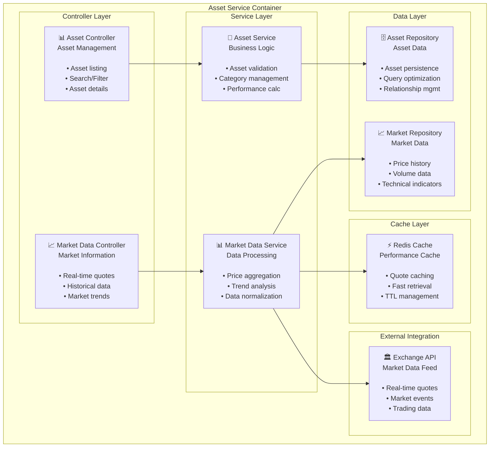
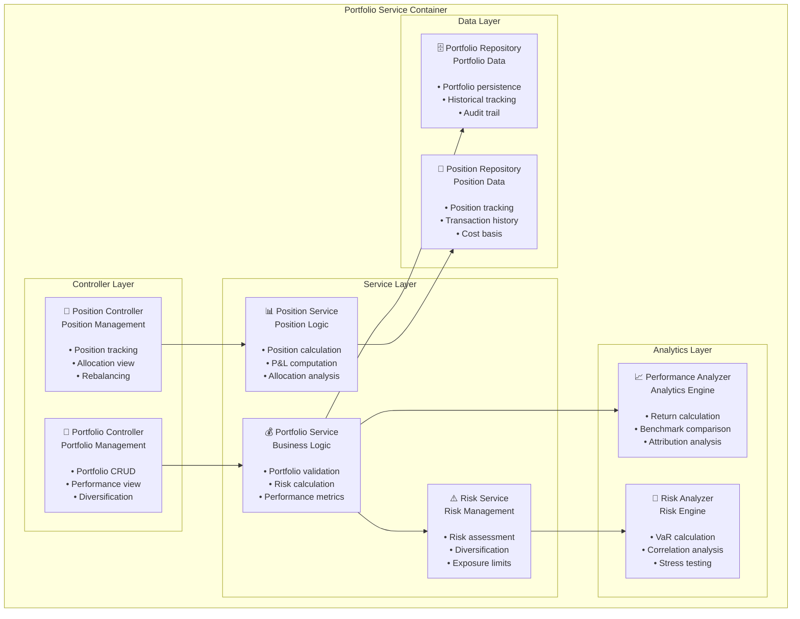
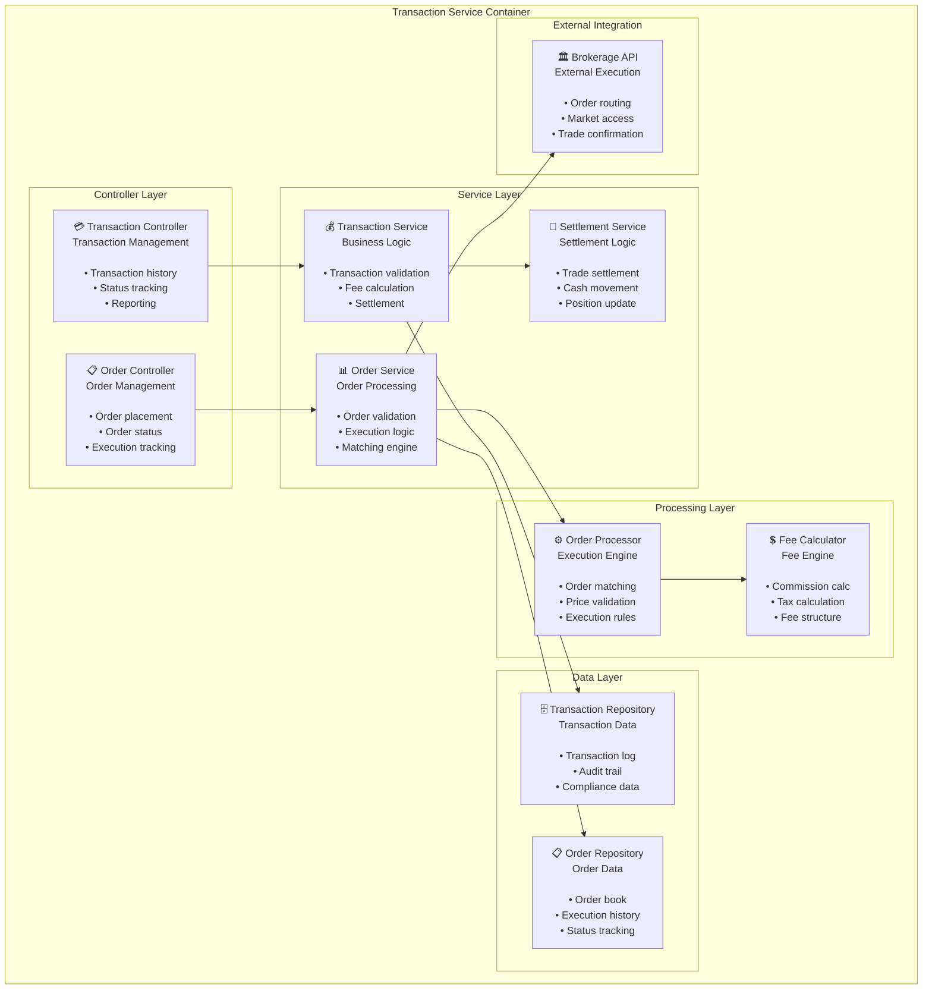
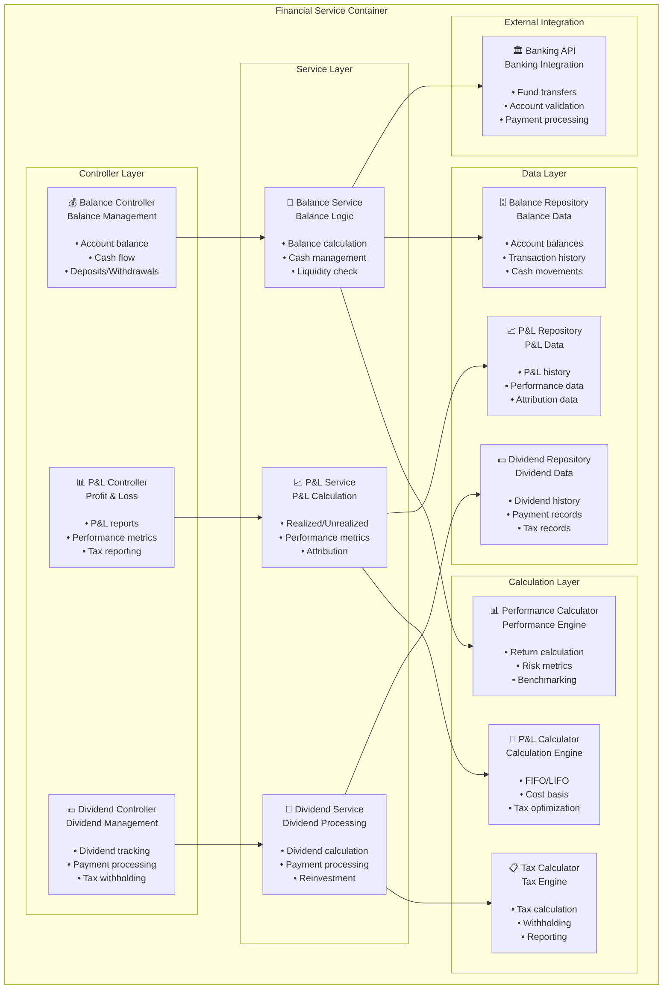

# 02 - Componentes Internos dos Microservices
## Estrutura Interna de Cada Serviço

### Introdução

Este documento detalha a arquitetura interna de cada microservice, mostrando como os componentes se organizam e interagem dentro de cada container. Cada serviço segue uma arquitetura em camadas bem definida.

### Padrão Arquitetural Comum

Todos os microservices seguem o mesmo padrão de organização em camadas:

## 2.1 API Gateway - Componentes

**Responsabilidades do API Gateway:**
- **Roteamento**: Direciona requisições para o microservice correto
- **Autenticação**: Valida tokens JWT centralizadamente
- **Rate Limiting**: Controla taxa de requisições por usuário/IP
- **Monitoramento**: Coleta métricas e monitora saúde dos serviços
- **Documentação**: Centraliza documentação de todas as APIs

## 2.2 Identity Service - Componentes

**Responsabilidades do Identity Service:**
- **Autenticação**: Login, logout e validação de credenciais
- **Gestão de Usuários**: CRUD de usuários e perfis
- **Segurança**: Hash de senhas e gestão de tokens JWT
- **Notificações**: Envio de emails de boas-vindas e recuperação

## 2.3 Asset Service - Componentes

**Responsabilidades do Asset Service:**
- **Catálogo de Ativos**: Gestão de ações, fundos e outros instrumentos
- **Dados de Mercado**: Coleta e processamento de cotações
- **Cache**: Otimização de performance para dados frequentes
- **Integração Externa**: Conexão com bolsas e provedores de dados

## 2.4 Portfolio Service - Componentes

**Responsabilidades do Portfolio Service:**
- **Gestão de Carteiras**: CRUD de portfolios e configurações
- **Posições**: Tracking de posições e alocações
- **Análise de Risco**: Cálculo de VaR, correlações e stress tests
- **Performance**: Métricas de retorno e comparação com benchmarks

## 2.5 Transaction Service - Componentes

**Responsabilidades do Transaction Service:**
- **Ordens**: Processamento de ordens de compra e venda
- **Execução**: Engine de matching e execução de trades
- **Settlement**: Liquidação de transações e movimentação de caixa
- **Fees**: Cálculo de comissões, taxas e impostos

## 2.6 Financial Service - Componentes

**Responsabilidades do Financial Service:**
- **Saldos**: Gestão de saldos em caixa e movimentações
- **P&L**: Cálculo de lucros e perdas realizados/não realizados
- **Dividendos**: Processamento de dividendos e reinvestimentos
- **Impostos**: Cálculo de impostos e otimização fiscal

### Padrões Arquiteturais Utilizados

#### **Layered Architecture:**
- **Controller Layer**: Gerencia requisições HTTP e respostas
- **Service Layer**: Contém lógica de negócio
- **Repository Layer**: Abstrai acesso a dados
- **External Integration**: Gerencia comunicação externa

#### **Dependency Injection:**
- Inversão de controle entre camadas
- Facilita testes unitários
- Reduz acoplamento

#### **Repository Pattern:**
- Abstração do acesso a dados
- Facilita mudanças de banco de dados
- Melhora testabilidade

#### **Strategy Pattern:**
- Diferentes algoritmos de cálculo (P&L, Risk)
- Flexibilidade para mudanças de regras
- Extensibilidade

### Comunicação Entre Componentes

#### **Intra-Service Communication:**
- Controllers chamam Services
- Services chamam Repositories
- Middleware intercepta requisições

#### **Inter-Service Communication:**
- HTTP/REST para operações síncronas
- Validação de dados entre serviços
- Timeouts e circuit breakers

### Benefícios da Decomposição

- **Responsabilidade Única**: Cada componente tem uma responsabilidade específica
- **Testabilidade**: Componentes podem ser testados isoladamente
- **Manutenibilidade**: Facilita localização e correção de bugs
- **Extensibilidade**: Novos componentes podem ser adicionados facilmente
- **Reutilização**: Componentes podem ser reutilizados em diferentes contextos 