# 02 - Componentes Internos dos Microservices
## Estrutura Interna de Cada Serviço

### Introdução

Este documento detalha a arquitetura interna de cada microservice, mostrando como os componentes se organizam e interagem dentro de cada container. Cada serviço segue uma arquitetura em camadas bem definida.

### Padrão Arquitetural Comum

Todos os microservices seguem o mesmo padrão de organização em camadas:

```mermaid
graph TB
    subgraph "Microservice Architecture Pattern"
        subgraph "Presentation Layer"
            Controllers["🎮 Controllers<br/>• HTTP Request/Response<br/>• Input Validation<br/>• Error Handling"]
        end
        
        subgraph "Business Layer"
            Services["⚙️ Services<br/>• Business Logic<br/>• Data Processing<br/>• External Integration"]
        end
        
        subgraph "Data Layer"
            Repositories["🗄️ Repositories<br/>• Data Access<br/>• Query Optimization<br/>• Transaction Management"]
        end
        
        subgraph "Cross-Cutting"
            Middleware["🛡️ Middleware<br/>• Authentication<br/>• Logging<br/>• Error Handling"]
        end
    end
    
    Controllers --> Services
    Services --> Repositories
    Middleware -.-> Controllers
    Middleware -.-> Services
```

## 2.1 API Gateway - Componentes

```mermaid
graph TB
    subgraph "API Gateway Container"
        subgraph "Routing Layer"
            Router["🔀 Router<br/>Express Router<br/><br/>• Route matching<br/>• Path rewriting<br/>• Load balancing"]
            
            ProxyMiddleware["🔄 Proxy Middleware<br/>http-proxy-middleware<br/><br/>• Request forwarding<br/>• Response handling<br/>• Timeout management"]
        end
        
        subgraph "Security Layer"
            AuthMiddleware["🔐 Auth Middleware<br/>JWT Validation<br/><br/>• Token verification<br/>• User context<br/>• Permission check"]
            
            RateLimiter["⏱️ Rate Limiter<br/>express-rate-limit<br/><br/>• Request throttling<br/>• IP-based limits<br/>• API quotas"]
            
            CORS["🌐 CORS Handler<br/>Cross-Origin<br/><br/>• Origin validation<br/>• Headers control<br/>• Preflight handling"]
        end
        
        subgraph "Monitoring Layer"
            HealthChecker["🏥 Health Checker<br/>Service Monitor<br/><br/>• Service status<br/>• Response time<br/>• Availability check"]
            
            Logger["📝 Logger<br/>Winston/Morgan<br/><br/>• Request logging<br/>• Error tracking<br/>• Audit trail"]
            
            Metrics["📊 Metrics<br/>Prometheus<br/><br/>• Performance data<br/>• Usage statistics<br/>• SLA monitoring"]
        end
        
        subgraph "Documentation"
            SwaggerUI["📚 Swagger UI<br/>API Documentation<br/><br/>• Interactive docs<br/>• Schema validation<br/>• Testing interface"]
        end
    end
    
    %% Flow
    Router --> ProxyMiddleware
    AuthMiddleware --> Router
    RateLimiter --> AuthMiddleware
    CORS --> RateLimiter
    
    HealthChecker -.-> Router
    Logger -.-> Router
    Metrics -.-> Router
    SwaggerUI -.-> Router
```

**Responsabilidades do API Gateway:**
- **Roteamento**: Direciona requisições para o microservice correto
- **Autenticação**: Valida tokens JWT centralizadamente
- **Rate Limiting**: Controla taxa de requisições por usuário/IP
- **Monitoramento**: Coleta métricas e monitora saúde dos serviços
- **Documentação**: Centraliza documentação de todas as APIs

## 2.2 Identity Service - Componentes

```mermaid
graph TB
    subgraph "Identity Service Container"
        subgraph "Controller Layer"
            AuthController["🔐 Auth Controller<br/>Authentication Logic<br/><br/>• Login/Logout<br/>• Token generation<br/>• Password validation"]
            
            UserController["👤 User Controller<br/>User Management<br/><br/>• Profile management<br/>• User registration<br/>• Account updates"]
        end
        
        subgraph "Service Layer"
            AuthService["🛡️ Auth Service<br/>Business Logic<br/><br/>• JWT handling<br/>• Password hashing<br/>• Session management"]
            
            UserService["👥 User Service<br/>User Operations<br/><br/>• User CRUD<br/>• Profile validation<br/>• Account status"]
        end
        
        subgraph "Security Layer"
            JWTMiddleware["🎫 JWT Middleware<br/>Token Validation<br/><br/>• Token verification<br/>• Expiry check<br/>• Refresh logic"]
            
            PasswordHash["🔒 Password Hash<br/>bcrypt<br/><br/>• Hash generation<br/>• Salt management<br/>• Comparison"]
        end
        
        subgraph "Data Layer"
            UserRepository["🗄️ User Repository<br/>Data Access<br/><br/>• Database queries<br/>• User persistence<br/>• Query optimization"]
        end
        
        subgraph "External Integration"
            EmailService["📧 Email Service<br/>Notification<br/><br/>• Welcome emails<br/>• Password reset<br/>• Account alerts"]
        end
    end
    
    %% Flow
    AuthController --> AuthService
    UserController --> UserService
    AuthService --> JWTMiddleware
    AuthService --> PasswordHash
    UserService --> UserRepository
    AuthService --> EmailService
```

**Responsabilidades do Identity Service:**
- **Autenticação**: Login, logout e validação de credenciais
- **Gestão de Usuários**: CRUD de usuários e perfis
- **Segurança**: Hash de senhas e gestão de tokens JWT
- **Notificações**: Envio de emails de boas-vindas e recuperação

## 2.3 Asset Service - Componentes

```mermaid
graph TB
    subgraph "Asset Service Container"
        subgraph "Controller Layer"
            AssetController["📊 Asset Controller<br/>Asset Management<br/><br/>• Asset listing<br/>• Search/Filter<br/>• Asset details"]
            
            MarketDataController["📈 Market Data Controller<br/>Market Information<br/><br/>• Real-time quotes<br/>• Historical data<br/>• Market trends"]
        end
        
        subgraph "Service Layer"
            AssetService["🏢 Asset Service<br/>Business Logic<br/><br/>• Asset validation<br/>• Category management<br/>• Performance calc"]
            
            MarketDataService["📊 Market Data Service<br/>Data Processing<br/><br/>• Price aggregation<br/>• Trend analysis<br/>• Data normalization"]
        end
        
        subgraph "Cache Layer"
            RedisCache["⚡ Redis Cache<br/>Performance Cache<br/><br/>• Quote caching<br/>• Fast retrieval<br/>• TTL management"]
        end
        
        subgraph "Data Layer"
            AssetRepository["🗄️ Asset Repository<br/>Asset Data<br/><br/>• Asset persistence<br/>• Query optimization<br/>• Relationship mgmt"]
            
            MarketDataRepository["📈 Market Repository<br/>Market Data<br/><br/>• Price history<br/>• Volume data<br/>• Technical indicators"]
        end
        
        subgraph "External Integration"
            ExchangeAPI["🏛️ Exchange API<br/>Market Data Feed<br/><br/>• Real-time quotes<br/>• Market events<br/>• Trading data"]
        end
    end
    
    %% Flow
    AssetController --> AssetService
    MarketDataController --> MarketDataService
    AssetService --> AssetRepository
    MarketDataService --> MarketDataRepository
    MarketDataService --> RedisCache
    MarketDataService --> ExchangeAPI
```

**Responsabilidades do Asset Service:**
- **Catálogo de Ativos**: Gestão de ações, fundos e outros instrumentos
- **Dados de Mercado**: Coleta e processamento de cotações
- **Cache**: Otimização de performance para dados frequentes
- **Integração Externa**: Conexão com bolsas e provedores de dados

## 2.4 Portfolio Service - Componentes

**Responsabilidades do Portfolio Service:**
- **Gestão de Carteiras**: CRUD de portfolios e configurações
- **Posições**: Tracking de posições e alocações
- **Análise de Risco**: Cálculo de VaR, correlações e stress tests
- **Performance**: Métricas de retorno e comparação com benchmarks

## 2.5 Transaction Service - Componentes

**Responsabilidades do Transaction Service:**
- **Ordens**: Processamento de ordens de compra e venda
- **Execução**: Engine de matching e execução de trades
- **Settlement**: Liquidação de transações e movimentação de caixa
- **Fees**: Cálculo de comissões, taxas e impostos

## 2.6 Financial Service - Componentes

```mermaid
graph TB
    subgraph "Financial Service Container"
        subgraph "Controller Layer"
            BalanceController["💰 Balance Controller<br/>Balance Management<br/><br/>• Account balance<br/>• Cash flow<br/>• Deposits/Withdrawals"]
            
            PnLController["📊 P&L Controller<br/>Profit & Loss<br/><br/>• P&L reports<br/>• Performance metrics<br/>• Tax reporting"]
            
            DividendController["💵 Dividend Controller<br/>Dividend Management<br/><br/>• Dividend tracking<br/>• Payment processing<br/>• Tax withholding"]
        end
        
        subgraph "Service Layer"
            BalanceService["🏦 Balance Service<br/>Balance Logic<br/><br/>• Balance calculation<br/>• Cash management<br/>• Liquidity check"]
            
            PnLService["📈 P&L Service<br/>P&L Calculation<br/><br/>• Realized/Unrealized<br/>• Performance metrics<br/>• Attribution"]
            
            DividendService["💸 Dividend Service<br/>Dividend Processing<br/><br/>• Dividend calculation<br/>• Payment processing<br/>• Reinvestment"]
        end
        
        subgraph "Calculation Layer"
            PnLCalculator["🧮 P&L Calculator<br/>Calculation Engine<br/><br/>• FIFO/LIFO<br/>• Cost basis<br/>• Tax optimization"]
            
            TaxCalculator["📋 Tax Calculator<br/>Tax Engine<br/><br/>• Tax calculation<br/>• Withholding<br/>• Reporting"]
            
            PerformanceCalculator["📊 Performance Calculator<br/>Performance Engine<br/><br/>• Return calculation<br/>• Risk metrics<br/>• Benchmarking"]
        end
        
        subgraph "Data Layer"
            BalanceRepository["🗄️ Balance Repository<br/>Balance Data<br/><br/>• Account balances<br/>• Transaction history<br/>• Cash movements"]
            
            PnLRepository["📈 P&L Repository<br/>P&L Data<br/><br/>• P&L history<br/>• Performance data<br/>• Attribution data"]
            
            DividendRepository["💵 Dividend Repository<br/>Dividend Data<br/><br/>• Dividend history<br/>• Payment records<br/>• Tax records"]
        end
        
        subgraph "External Integration"
            BankingAPI["🏛️ Banking API<br/>Banking Integration<br/><br/>• Fund transfers<br/>• Account validation<br/>• Payment processing"]
        end
    end
    
    %% Flow
    BalanceController --> BalanceService
    PnLController --> PnLService
    DividendController --> DividendService
    
    PnLService --> PnLCalculator
    DividendService --> TaxCalculator
    BalanceService --> PerformanceCalculator
    
    BalanceService --> BalanceRepository
    PnLService --> PnLRepository
    DividendService --> DividendRepository
    
    BalanceService --> BankingAPI
```

**Responsabilidades do Financial Service:**
- **Saldos**: Gestão de saldos em caixa e movimentações
- **P&L**: Cálculo de lucros e perdas realizados/não realizados
- **Dividendos**: Processamento de dividendos e reinvestimentos
- **Impostos**: Cálculo de impostos e otimização fiscal

### Padrões Arquiteturais Utilizados

#### **Layered Architecture:**
- **Controller Layer**: Gerencia requisições HTTP e respostas
- **Service Layer**: Contém lógica de negócio
- **Repository Layer**: Abstrai acesso a dados
- **External Integration**: Gerencia comunicação externa

#### **Dependency Injection:**
- Inversão de controle entre camadas
- Facilita testes unitários
- Reduz acoplamento

#### **Repository Pattern:**
- Abstração do acesso a dados
- Facilita mudanças de banco de dados
- Melhora testabilidade

#### **Strategy Pattern:**
- Diferentes algoritmos de cálculo (P&L, Risk)
- Flexibilidade para mudanças de regras
- Extensibilidade

### Comunicação Entre Componentes

#### **Intra-Service Communication:**
- Controllers chamam Services
- Services chamam Repositories
- Middleware intercepta requisições

#### **Inter-Service Communication:**
- HTTP/REST para operações síncronas
- Validação de dados entre serviços
- Timeouts e circuit breakers

### Benefícios da Decomposição

- **Responsabilidade Única**: Cada componente tem uma responsabilidade específica
- **Testabilidade**: Componentes podem ser testados isoladamente
- **Manutenibilidade**: Facilita localização e correção de bugs
- **Extensibilidade**: Novos componentes podem ser adicionados facilmente
- **Reutilização**: Componentes podem ser reutilizados em diferentes contextos 