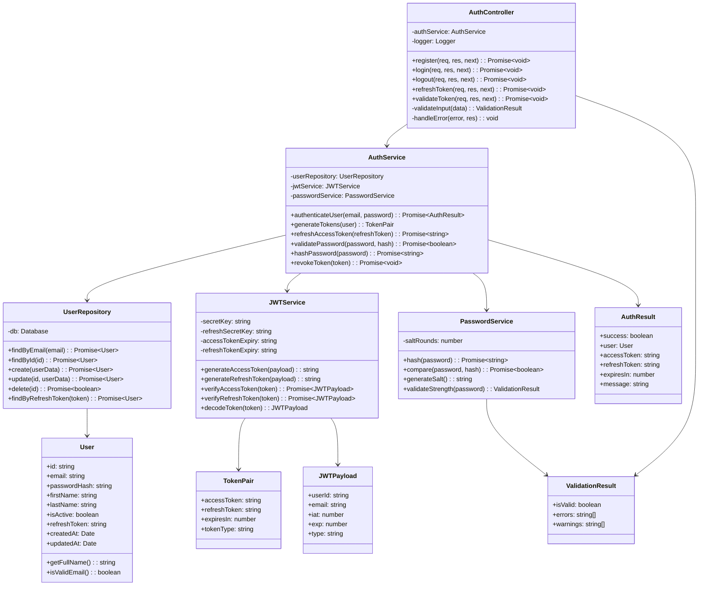
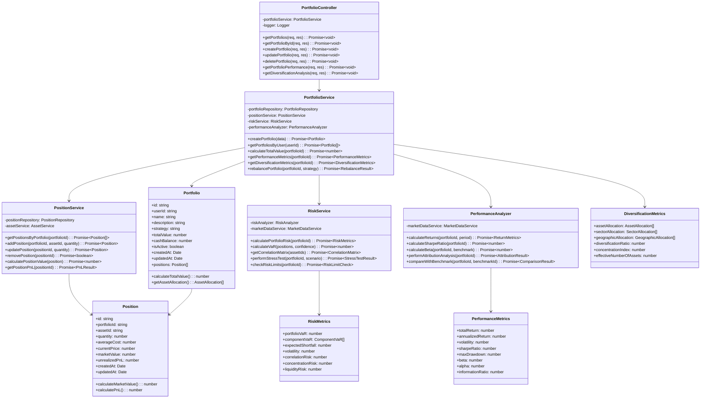
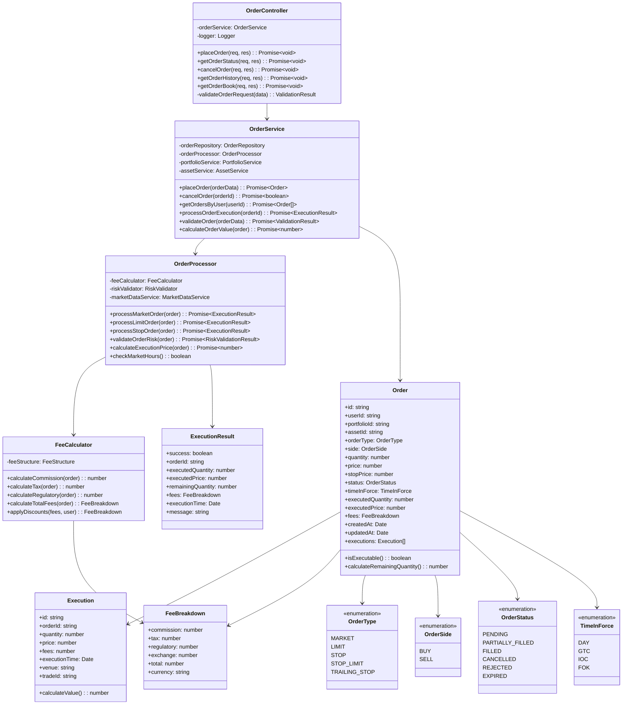
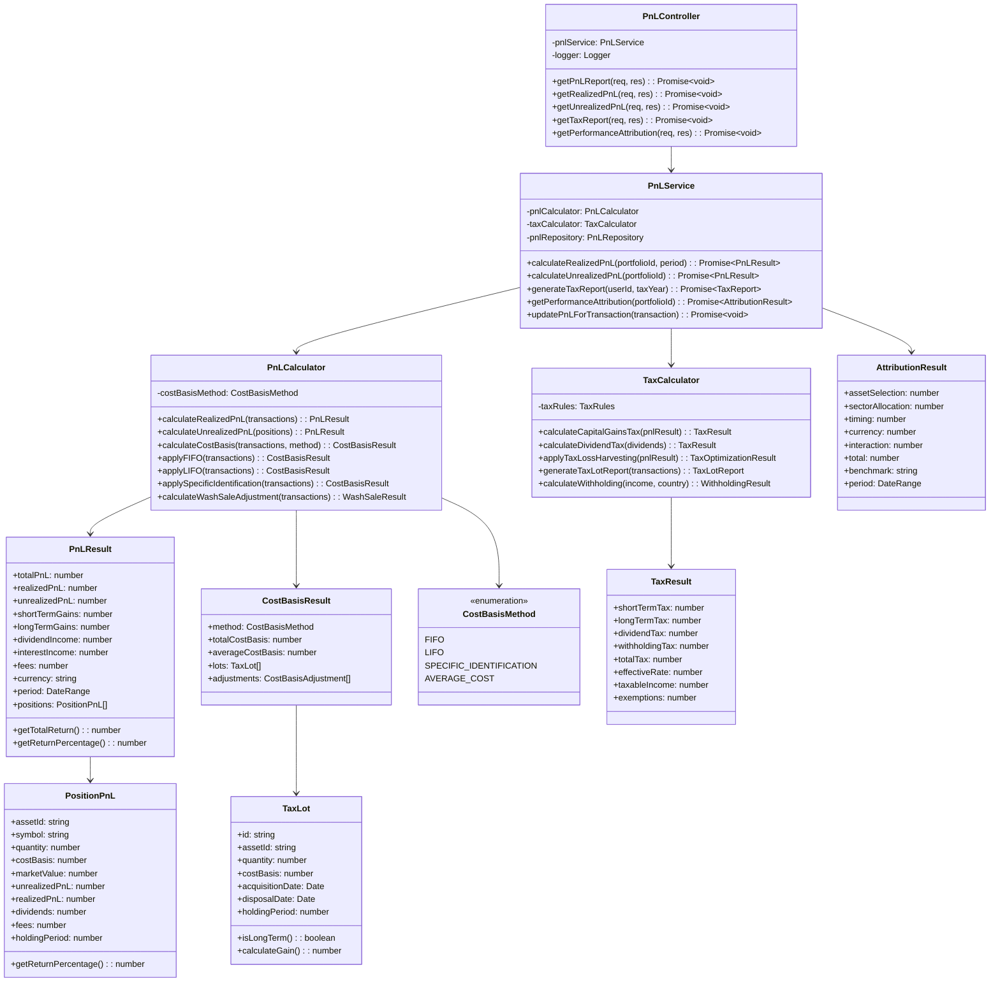

# 03 - Implementação de Código
## Detalhes de Classes e Interfaces dos Componentes Críticos

### Introdução

Este documento apresenta os detalhes de implementação dos componentes mais críticos do sistema, mostrando classes, interfaces e suas relações através de diagramas UML. O foco está nos padrões de design utilizados e na estrutura de dados.

### Padrões de Design Implementados

#### **Strategy Pattern:**
- `CostBasisMethod`: Diferentes algoritmos de cálculo de custo base
- `OrderType`: Diferentes tipos de execução de ordens
- `FeeCalculator`: Diferentes estruturas de taxas

#### **Factory Pattern:**
- `OrderFactory`: Criação de diferentes tipos de ordem
- `CalculatorFactory`: Criação de calculadoras específicas
- `ReportFactory`: Geração de diferentes tipos de relatório

#### **Observer Pattern:**
- `OrderStatusObserver`: Notificação de mudanças de status
- `PnLObserver`: Atualização automática de P&L
- `RiskObserver`: Monitoramento de limites de risco

#### **Repository Pattern:**
- Abstração do acesso a dados
- Facilita testes unitários
- Permite mudança de tecnologia de persistência

#### **Command Pattern:**
- `OrderCommand`: Encapsula operações de ordem
- `TransactionCommand`: Operações de transação
- `RebalanceCommand`: Operações de rebalanceamento

## 3.1 Identity Service - Estrutura de Classes



**Responsabilidades das Classes:**
- **AuthController**: Gerencia endpoints de autenticação
- **AuthService**: Lógica de negócio de autenticação
- **JWTService**: Geração e validação de tokens JWT
- **PasswordService**: Hash e validação de senhas
- **UserRepository**: Acesso a dados de usuários

## 3.2 Portfolio Service - Estrutura de Classes



**Responsabilidades das Classes:**
- **PortfolioController**: Endpoints de gestão de carteiras
- **PortfolioService**: Lógica de negócio de portfolios
- **PositionService**: Gestão de posições individuais
- **RiskService**: Cálculos de risco e análise
- **PerformanceAnalyzer**: Métricas de performance

## 3.3 Transaction Service - Estrutura de Classes



**Responsabilidades das Classes:**
- **OrderController**: Endpoints de gestão de ordens
- **OrderService**: Lógica de negócio de ordens
- **OrderProcessor**: Engine de processamento e execução
- **FeeCalculator**: Cálculo de taxas e comissões
- **Order**: Entidade principal de ordem

## 3.4 Financial Service - Estrutura de Classes



**Responsabilidades das Classes:**
- **PnLController**: Endpoints de P&L e relatórios
- **PnLService**: Lógica de negócio de P&L
- **PnLCalculator**: Algoritmos de cálculo de P&L
- **TaxCalculator**: Cálculos fiscais e otimização
- **PnLResult**: Resultado consolidado de P&L

### Interfaces Principais

#### **IRepository<T>**
```typescript
interface IRepository<T> {
    findById(id: string): Promise<T | null>;
    findAll(): Promise<T[]>;
    create(entity: T): Promise<T>;
    update(id: string, entity: Partial<T>): Promise<T>;
    delete(id: string): Promise<boolean>;
}
```

#### **ICalculator**
```typescript
interface ICalculator {
    calculate(input: any): Promise<any>;
    validate(input: any): ValidationResult;
    getConfiguration(): CalculatorConfig;
}
```

#### **INotificationService**
```typescript
interface INotificationService {
    sendEmail(to: string, subject: string, body: string): Promise<boolean>;
    sendSMS(to: string, message: string): Promise<boolean>;
    sendPushNotification(userId: string, message: string): Promise<boolean>;
}
```

### Benefícios da Implementação

#### **Testabilidade**
- Cada classe tem responsabilidade única
- Interfaces facilitam mocking
- Dependency injection permite isolamento

#### **Extensibilidade**
- Novos algoritmos podem ser adicionados facilmente
- Strategy pattern permite mudanças de comportamento
- Factory pattern facilita criação de objetos

#### **Manutenibilidade**
- Código organizado e bem estruturado
- Separação clara de responsabilidades
- Documentação através de interfaces

#### **Performance**
- Otimizações específicas por componente
- Cache implementado onde necessário
- Lazy loading para dados pesados

#### **Compliance**
- Facilita auditoria e regulamentação
- Logs detalhados de todas as operações
- Rastreabilidade completa de transações