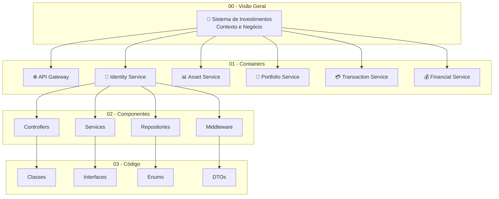

# Documentação de Arquitetura - Sistema de Investimentos
## Microservices Architecture Documentation

### Visão Geral

Esta documentação apresenta a arquitetura completa do Sistema de Investimentos utilizando uma abordagem hierárquica de documentação de arquitetura de software. A documentação está organizada em níveis progressivos de detalhamento, desde uma visão de alto nível até detalhes de implementação.

### 📚 Estrutura da Documentação para Apresentação

#### **00 - [Visão Geral do Sistema](./00-visao-geral-sistema.md)**
**Contexto e Introdução**
- Apresentação do sistema como um todo
- Atores e sistemas externos
- Fluxos principais de negócio
- Benefícios da arquitetura
- **Audiência**: Executivos, Product Owners, Stakeholders

**Elementos principais:**
- Usuários (Investidores, Administradores)
- Sistema de Investimentos (visão externa)
- Sistemas Externos (Bolsa, Bancos, Reguladores)
- Fluxos de negócio principais

#### **01 - [Arquitetura de Containers](./01-arquitetura-containers.md)**
**Decomposição em Microservices**
- Containers e suas responsabilidades
- Comunicação entre microservices
- Padrões de fluxo implementados
- Estratégias de deployment
- **Audiência**: Arquitetos de Software, Tech Leads

**Elementos principais:**
- API Gateway (Porta 3000)
- 5 Microservices (Portas 3001-3005)
- PostgreSQL Database
- Sistemas de Monitoramento
- Fluxos de comunicação inter-serviços

#### **02 - [Componentes Internos](./02-componentes-internos.md)**
**Estrutura Interna dos Microservices**
- Decomposição de cada microservice
- Arquitetura em camadas
- Responsabilidades dos componentes
- Padrões arquiteturais utilizados
- **Audiência**: Desenvolvedores Sênior, Arquitetos

**Elementos principais:**
- Controllers, Services, Repositories
- Middleware de Segurança
- Calculadoras e Analisadores
- Integrações Externas
- Padrões de comunicação interna

#### **03 - [Implementação de Código](./03-implementacao-codigo.md)**
**Detalhes de Classes e Interfaces**
- Diagramas UML de classes
- Padrões de design implementados
- Estruturas de dados detalhadas
- Interfaces e contratos
- **Audiência**: Desenvolvedores, Code Reviewers

**Elementos principais:**
- Diagramas de Classes UML
- Padrões de Design (Strategy, Factory, Observer)
- Estruturas de Dados e DTOs
- Algoritmos de Negócio
- Interfaces e contratos

### 🏗️ Arquitetura Hierárquica

### 🎯 Roteiro de Apresentação

#### **Para Executivos e Stakeholders:**
1. **00 - Visão Geral**: Contexto, benefícios de negócio, ROI
2. **01 - Arquitetura**: Visão técnica de alto nível, escalabilidade

#### **Para Equipe Técnica:**
1. **00 - Visão Geral**: Contexto e requisitos
2. **01 - Arquitetura**: Microservices e comunicação
3. **02 - Componentes**: Estrutura interna e padrões
4. **03 - Código**: Implementação e design patterns

#### **Para Desenvolvedores:**
1. **02 - Componentes**: Arquitetura interna
2. **03 - Código**: Classes, interfaces e implementação
3. **01 - Arquitetura**: Comunicação entre serviços

### 📊 Microservices Overview

| Serviço | Porta | Responsabilidade | Status |
|---------|-------|------------------|--------|
| **API Gateway** | 3000 | Roteamento, Autenticação, Rate Limiting | ✅ Implementado |
| **Identity Service** | 3001 | Autenticação, Gestão de Usuários | ✅ Implementado |
| **Asset Service** | 3002 | Catálogo de Ativos, Dados de Mercado | ✅ Implementado |
| **Portfolio Service** | 3003 | Gestão de Carteiras, Análise de Risco | ✅ Implementado |
| **Transaction Service** | 3004 | Ordens, Execução, Settlement | ✅ Implementado |
| **Financial Service** | 3005 | P&L, Saldos, Dividendos | ✅ Implementado |

### 🔧 Tecnologias e Ferramentas

#### **Backend**
- **Runtime**: Node.js 18+
- **Framework**: Express.js
- **Database**: PostgreSQL 14+
- **Authentication**: JWT
- **Documentation**: Swagger/OpenAPI
- **Logging**: Winston

#### **DevOps**
- **Containerization**: Docker
- **Orchestration**: Docker Compose
- **Monitoring**: Health Checks
- **Process Management**: PM2
- **Automation**: Shell Scripts

#### **Development**
- **Language**: JavaScript (ES6+)
- **Package Manager**: npm
- **Architecture**: Microservices + API Gateway
- **Communication**: HTTP/REST
- **Patterns**: Repository, Strategy, Factory

### 🚀 Como Executar o Sistema

1. **Pré-requisitos**: Node.js 18+, PostgreSQL 14+
2. **Instalação**: `./start-all-services.sh`
3. **Verificação**: `http://localhost:3000/health`
4. **Documentação**: `http://localhost:3000/docs`

### 📈 Benefícios da Arquitetura

#### **Escalabilidade**
- Cada serviço escala independentemente
- Load balancing por serviço
- Resource allocation otimizada

#### **Manutenibilidade**
- Código organizado por domínio
- Responsabilidades bem definidas
- Facilita debugging e troubleshooting

#### **Flexibilidade**
- Deploy independente por serviço
- Tecnologias específicas por necessidade
- Facilita mudanças e evoluções

#### **Resiliência**
- Falhas isoladas por serviço
- Circuit breakers e timeouts
- Graceful degradation

### 🎯 Próximos Passos

#### **Melhorias Planejadas**
- [ ] Message Queue (RabbitMQ/Apache Kafka)
- [ ] Event Sourcing para auditoria
- [ ] CQRS para separação de leitura/escrita
- [ ] Circuit Breakers implementados
- [ ] Monitoring com Prometheus + Grafana
- [ ] Distributed Tracing com Jaeger

#### **Documentação Adicional**
- [ ] Guias de Deploy para produção
- [ ] Runbooks operacionais
- [ ] Disaster Recovery procedures
- [ ] Performance tuning guides
- [ ] Security best practices

### 📝 Como Usar Esta Documentação

1. **Para Entender o Negócio**: Comece pelo documento **00**
2. **Para Arquitetura Geral**: Vá para o documento **01**
3. **Para Implementação**: Consulte os documentos **02** e **03**
4. **Para Apresentações**: Use a sequência 00 → 01 → 02 → 03

### 🤝 Contribuição

Para contribuir com esta documentação:

1. Mantenha a consistência hierárquica
2. Use diagramas Mermaid para visualizações
3. Documente decisões arquiteturais
4. Mantenha exemplos atualizados
5. Revise regularmente para refletir mudanças

### 📚 Referências

- [Microservices Patterns](https://microservices.io/) - Chris Richardson
- [Building Microservices](https://www.oreilly.com/library/view/building-microservices/9781491950340/) - Sam Newman
- [Clean Architecture](https://blog.cleancoder.com/uncle-bob/2012/08/13/the-clean-architecture.html) - Robert C. Martin
- [Domain-Driven Design](https://www.domainlanguage.com/ddd/) - Eric Evans 