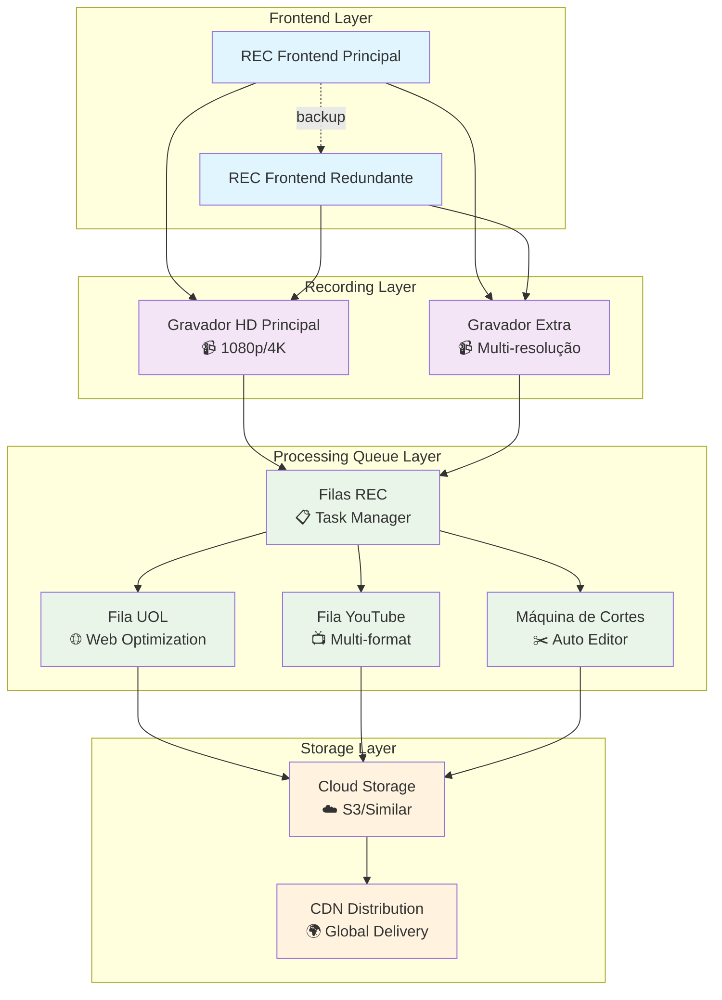
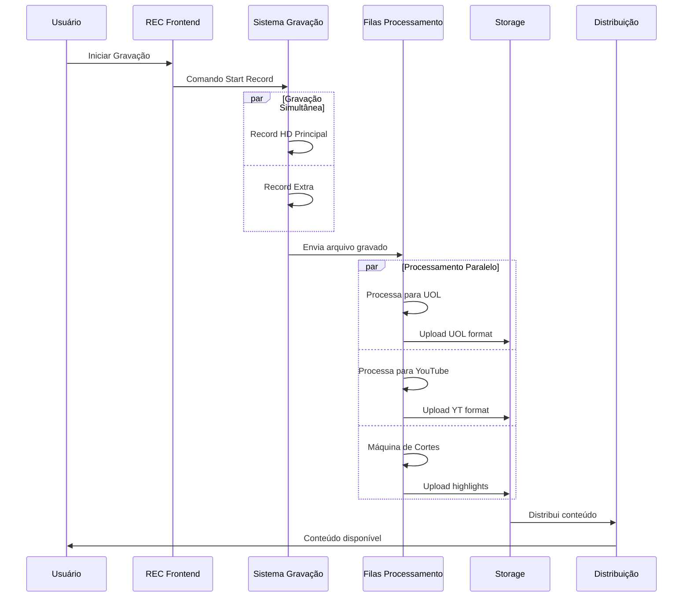

# Diagramas de Arquitetura - Sistema de Gravação

## Diagrama Geral da Arquitetura

```mermaid
graph TB
    subgraph "Frontend Layer"
        RF1[REC Frontend Principal]
        RF2[REC Frontend Redundante]
    end
    
    subgraph "Recording Layer"
        GHD[Gravador HD Principal<br/>📹 1080p/4K]
        GEX[Gravador Extra<br/>📹 Multi-resolução]
    end
    
    subgraph "Processing Queue Layer"
        UOL[Fila UOL<br/>🌐 Web Optimization]
        YT[Fila YouTube<br/>📺 Multi-format]
        MC[Máquina de Cortes<br/>✂️ Auto Editor]
        FR[Filas REC<br/>📋 Task Manager]
    end
    
    subgraph "Storage Layer"
        S3[Cloud Storage<br/>☁️ S3/Similar]
        CDN[CDN Distribution<br/>🌍 Global Delivery]
    end
    
    RF1 -.->|backup| RF2
    RF1 --> GHD
    RF1 --> GEX
    RF2 --> GHD
    RF2 --> GEX
    
    GHD --> FR
    GEX --> FR
    
    FR --> UOL
    FR --> YT
    FR --> MC
    
    UOL --> S3
    YT --> S3
    MC --> S3
    
    S3 --> CDN
    
    classDef frontend fill:#e1f5fe
    classDef recording fill:#f3e5f5
    classDef processing fill:#e8f5e8
    classDef storage fill:#fff3e0
    
    class RF1,RF2 frontend
    class GHD,GEX recording
    class UOL,YT,MC,FR processing
    class S3,CDN storage
```

## Fluxo de Processamento Detalhado

```mermaid
sequenceDiagram
    participant U as Usuário
    participant RF as REC Frontend
    participant G as Sistema Gravação
    participant Q as Filas Processamento
    participant S as Storage
    participant D as Distribuição
    
    U->>RF: Iniciar Gravação
    RF->>G: Comando Start Record
    
    par Gravação Simultânea
        G->>G: Record HD Principal
    and
        G->>G: Record Extra
    end
    
    G->>Q: Envia arquivo gravado
    
    par Processamento Paralelo
        Q->>Q: Processa para UOL
        Q->>S: Upload UOL format
    and
        Q->>Q: Processa para YouTube
        Q->>S: Upload YT format
    and
        Q->>Q: Máquina de Cortes
        Q->>S: Upload highlights
    end
    
    S->>D: Distribui conteúdo
    D->>U: Conteúdo disponível
```