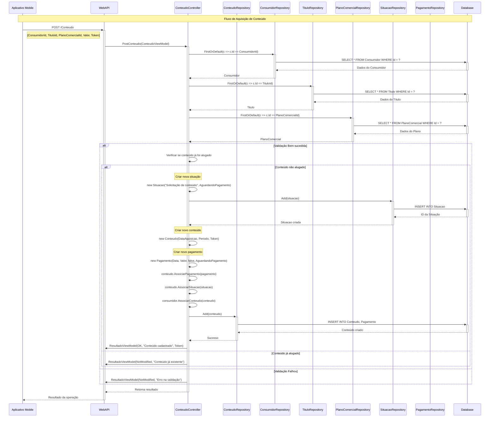
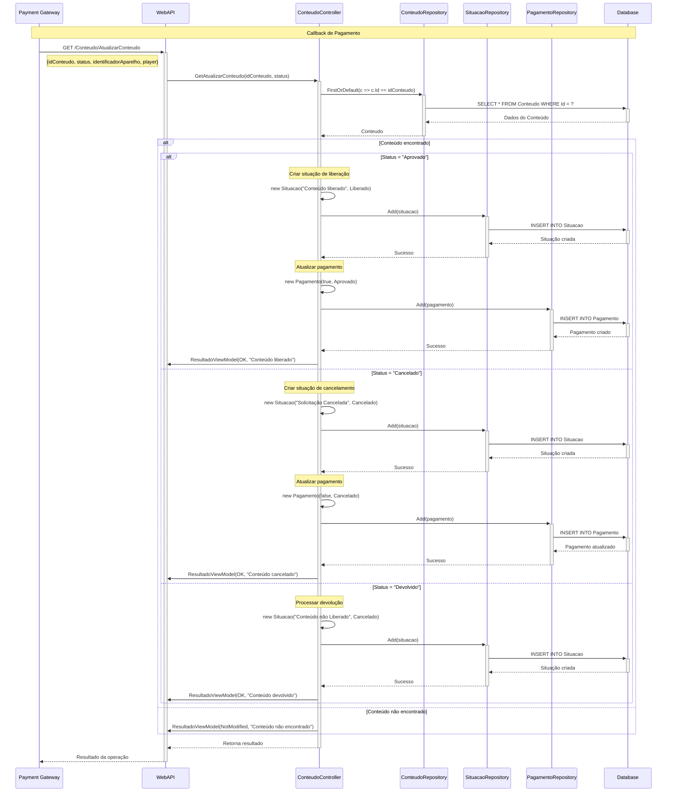
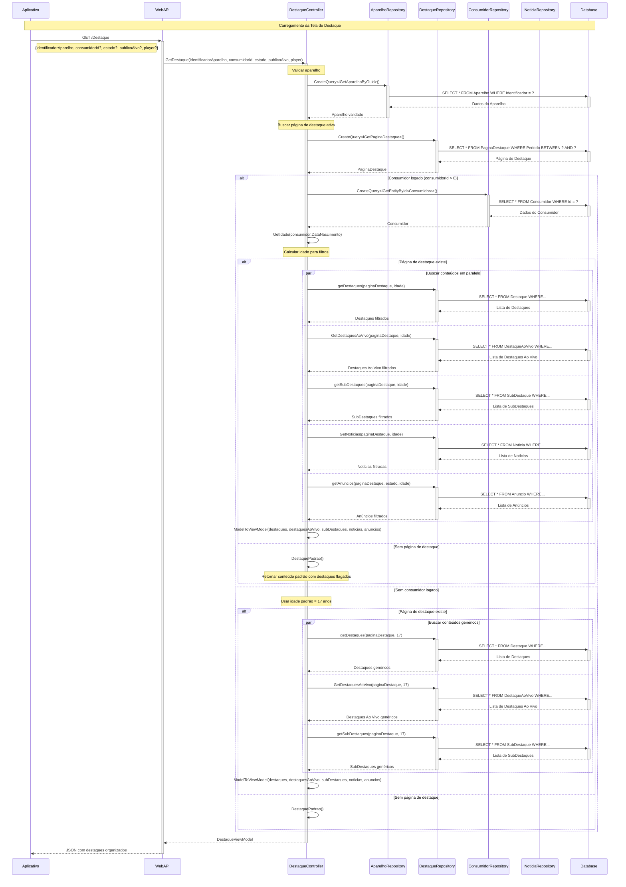
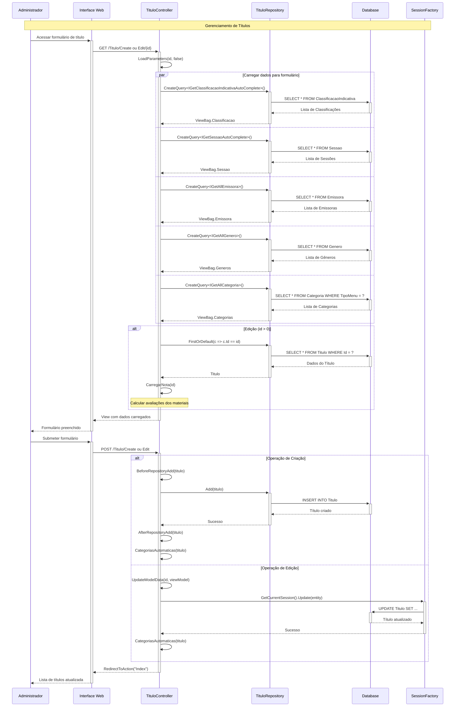
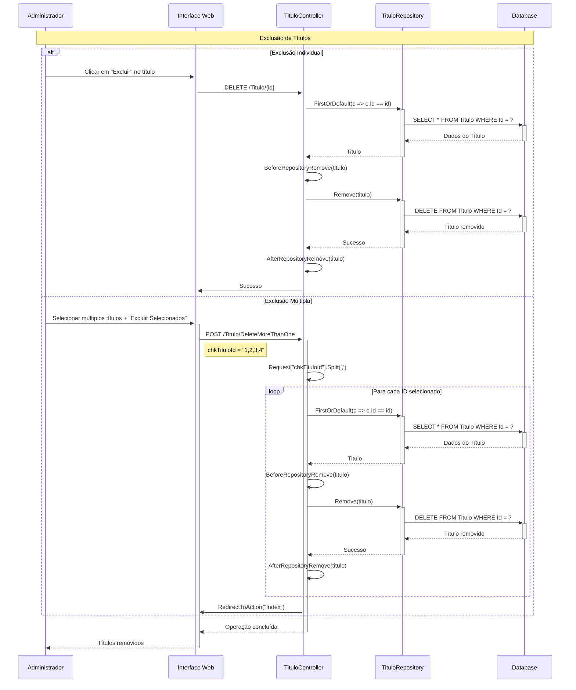
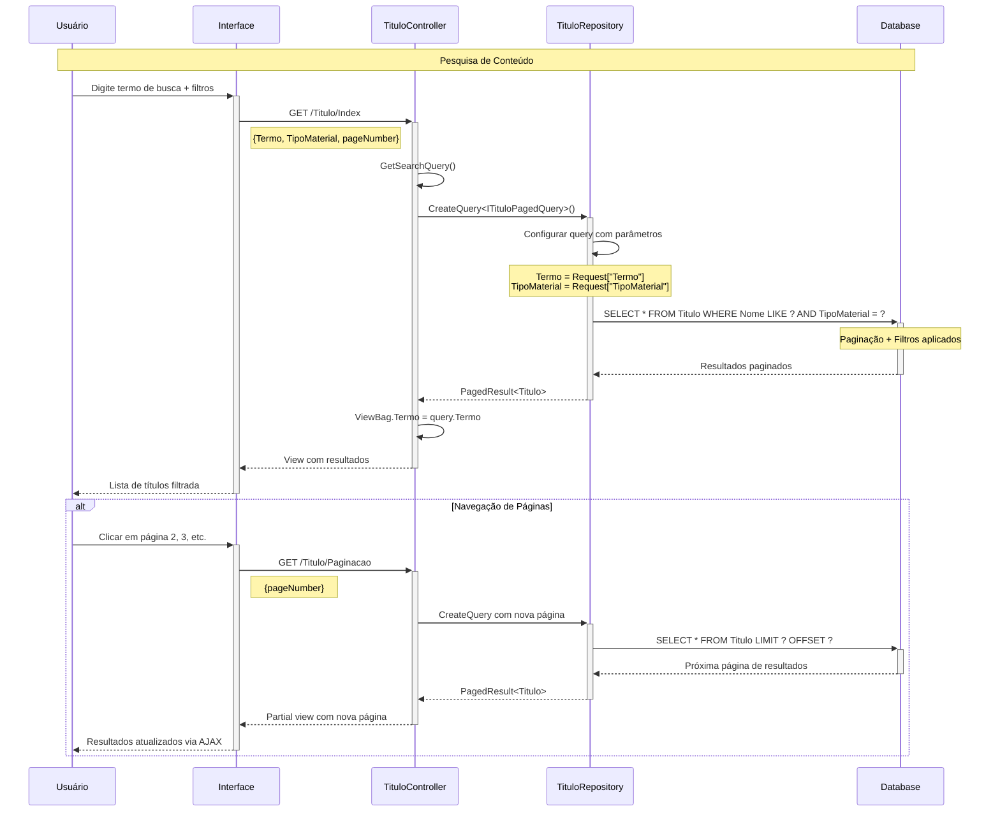

# Diagramas de Sequência - Central de Mídia

## Visão Geral

Este documento apresenta os principais fluxos da Central de Mídia através de diagramas de sequência detalhados, mostrando as interações entre os diferentes componentes do sistema.

## 1. Fluxo de Aquisição de Conteúdo

### 1.1 Solicitação de Compra/Aluguel

### 1.2 Atualização de Status de Pagamento

## 2. Fluxo de Exibição de Destaque

### 2.1 Carregamento da Página Principal

## 3. Fluxo de Gerenciamento de Títulos (Admin)

### 3.1 Criação/Edição de Título

### 3.2 Exclusão de Títulos

## 4. Fluxo de Busca e Filtros

### 4.1 Pesquisa de Títulos

