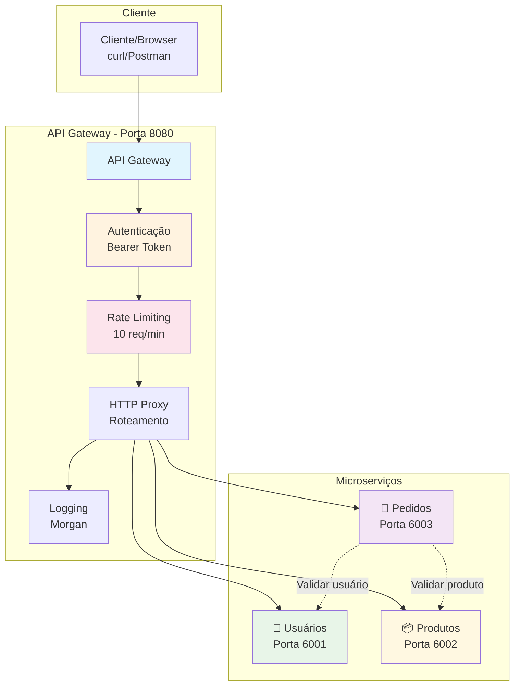
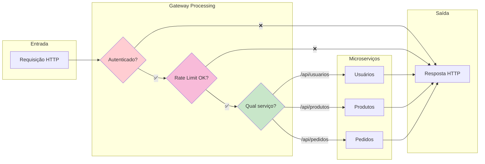
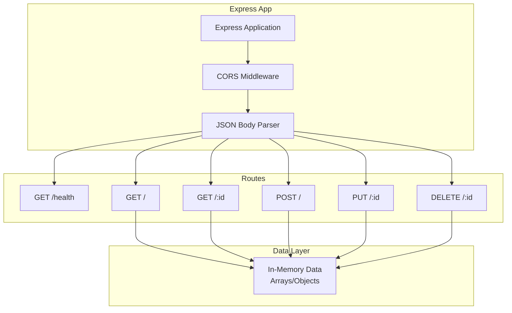

# 🏗️ Arquitetura do Sistema API Gateway

## 📐 Diagrama de Arquitetura Geral



## 🔄 Fluxo de Dados



## 🌐 Mapeamento de Rotas

```mermaid
graph TD
    subgraph "Rotas Públicas"
        H[GET /health]
    end
    
    subgraph "Rotas Protegidas"
        S[GET /servicos/status]
    end
    
    subgraph "Proxy para Microserviços"
        U1[GET /api/usuarios/*]
        U2[POST /api/usuarios/*]
        U3[PUT /api/usuarios/*]
        U4[DELETE /api/usuarios/*]
        
        P1[GET /api/produtos/*]
        P2[POST /api/produtos/*]
        P3[PUT /api/produtos/*]
        P4[DELETE /api/produtos/*]
        
        O1[GET /api/pedidos/*]
        O2[POST /api/pedidos/*]
        O3[PUT /api/pedidos/*]
        O4[DELETE /api/pedidos/*]
    end
    
    subgraph "Destinos"
        US[Usuários:6001]
        PR[Produtos:6002]
        PE[Pedidos:6003]
    end
    
    U1 --> US
    U2 --> US
    U3 --> US
    U4 --> US
    
    P1 --> PR
    P2 --> PR
    P3 --> PR
    P4 --> PR
    
    O1 --> PE
    O2 --> PE
    O3 --> PE
    O4 --> PE
    
    style H fill:#c8e6c9
    style S fill:#fff3e0
    style US fill:#e8f5e8
    style PR fill:#fff8e1
    style PE fill:#f3e5f5
```



## 🔧 Componentes Técnicos

### API Gateway (gateway.js)
```mermaid
graph TB
    subgraph "Middlewares"
        CORS[CORS<br/>Cross-Origin]
        JSON[JSON Parser<br/>Body Parser]
        MORGAN[Morgan<br/>HTTP Logger]
        AUTH[Auth Middleware<br/>Bearer Token]
        RATE[Rate Limiter<br/>express-rate-limit]
    end
    
    subgraph "Proxy Configuration"
        PROXY1[http-proxy-middleware<br/>→ Usuários]
        PROXY2[http-proxy-middleware<br/>→ Produtos]
        PROXY3[http-proxy-middleware<br/>→ Pedidos]
    end
    
    subgraph "Routes"
        HEALTH[/health]
        STATUS[/servicos/status]
        CATCH[404 Handler]
    end
    
    CORS --> JSON
    JSON --> MORGAN
    MORGAN --> AUTH
    AUTH --> RATE
    RATE --> PROXY1
    RATE --> PROXY2
    RATE --> PROXY3
    RATE --> HEALTH
    RATE --> STATUS
    RATE --> CATCH
```

### Microserviço Padrão


## 📊 Padrões Implementados

### 1. **API Gateway Pattern**
- ✅ Ponto único de entrada
- ✅ Roteamento baseado em path
- ✅ Agregação de serviços

### 2. **Authentication & Authorization**
- ✅ Bearer Token validation
- ✅ Centralized auth logic
- ✅ Token-based access control

### 3. **Rate Limiting**
- ✅ Per-IP rate limiting
- ✅ Configurable limits
- ✅ HTTP 429 responses

### 4. **Service Discovery (Simples)**
- ✅ Static service configuration
- ✅ Health check endpoints
- ✅ Service status monitoring

### 5. **Logging & Monitoring**
- ✅ HTTP request logging
- ✅ Error tracking
- ✅ Performance metrics

## 🚀 Benefícios da Arquitetura

### ✅ **Para Clientes**
- Interface unificada
- Autenticação simplificada
- Controle de acesso centralizado

### ✅ **Para Desenvolvedores**
- Separação de responsabilidades
- Desenvolvimento independente
- Facilidade de manutenção

### ✅ **Para Operações**
- Monitoramento centralizado
- Controle de tráfego
- Políticas de segurança unificadas

## 🔮 Evoluções Futuras

### Próximas Implementações:
- [ ] **Circuit Breaker** - Falha rápida em serviços indisponíveis
- [ ] **Load Balancing** - Distribuição entre múltiplas instâncias
- [ ] **Caching** - Cache de respostas frequentes
- [ ] **Service Discovery** - Descoberta automática de serviços
- [ ] **Distributed Tracing** - Rastreamento de requisições
- [ ] **API Versioning** - Versionamento de APIs 