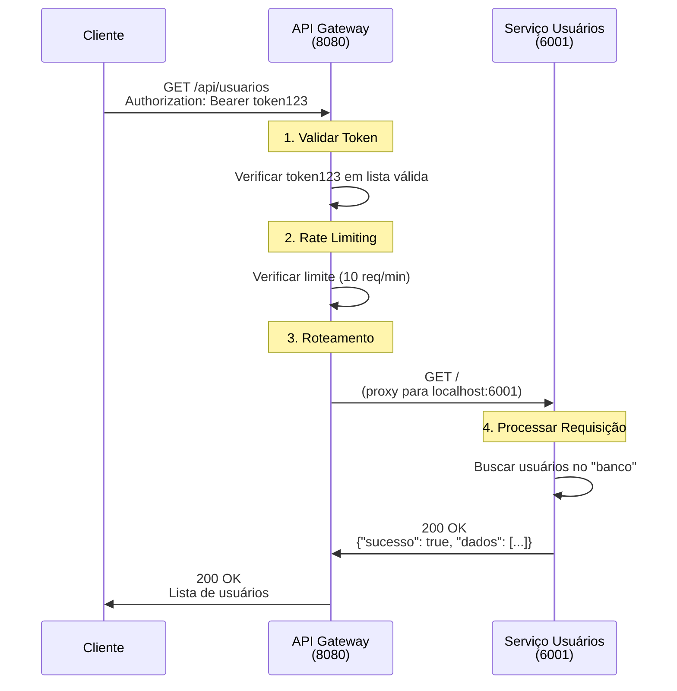
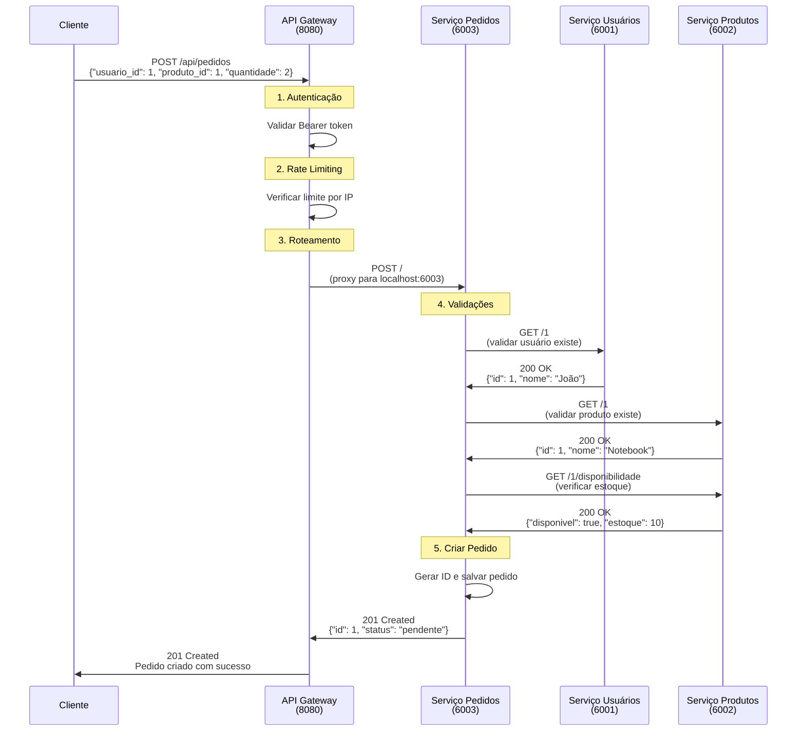
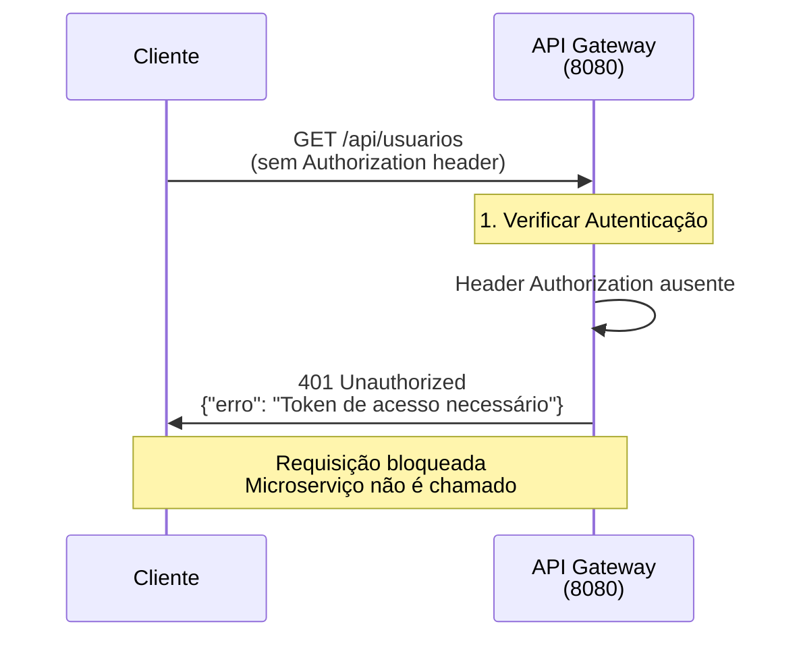
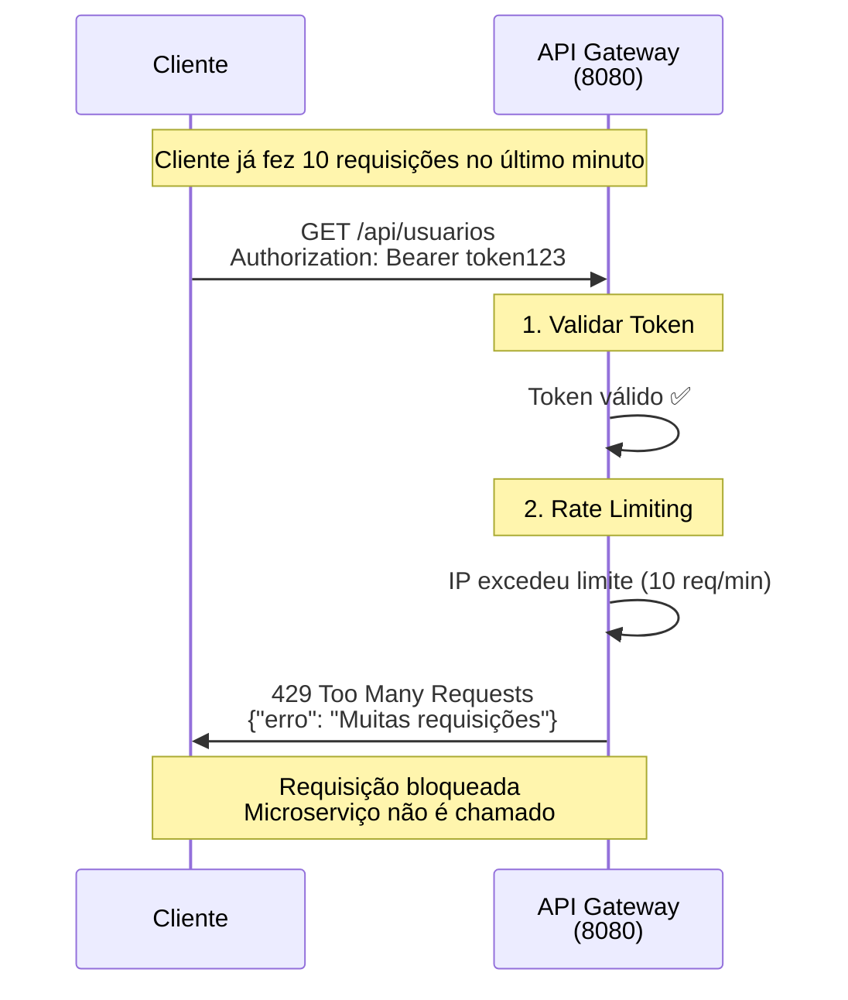
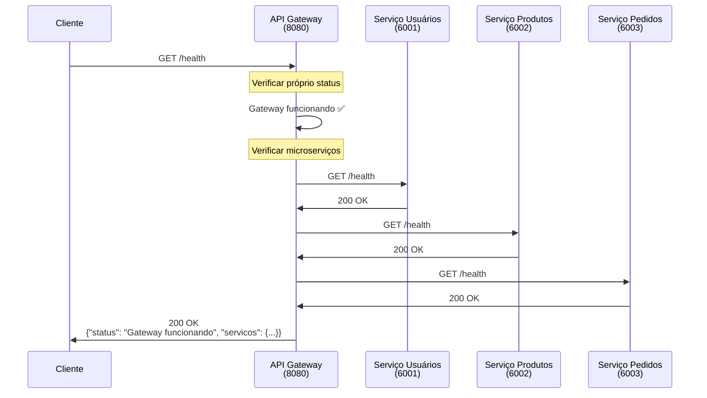
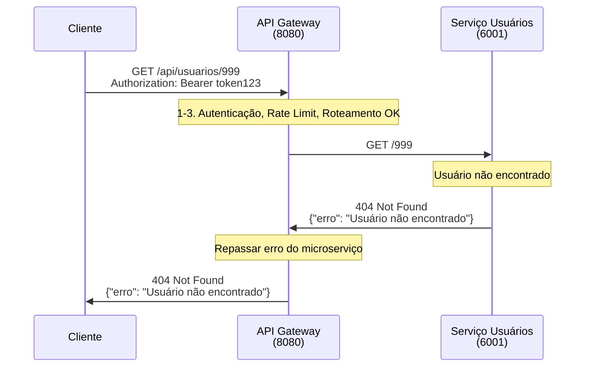

# 📊 Diagramas de Sequência - API Gateway

## 🔄 Fluxo 1: Requisição Simples (GET /api/usuarios)

## 🛒 Fluxo 2: Criação de Pedido (POST /api/pedidos)

## 🔒 Fluxo 3: Requisição Sem Autenticação

## ⚡ Fluxo 4: Rate Limiting Ativado

## 🏥 Fluxo 5: Health Check

## 🚨 Fluxo 6: Tratamento de Erro

## 📋 Legenda dos Componentes

| Componente | Porta | Responsabilidade |
|------------|-------|------------------|
| **Cliente** | - | Aplicação que consome a API |
| **API Gateway** | 8080 | Autenticação, Rate Limiting, Roteamento |
| **Serviço Usuários** | 6001 | CRUD de usuários |
| **Serviço Produtos** | 6002 | CRUD de produtos, estoque |
| **Serviço Pedidos** | 6003 | CRUD de pedidos, validações |

## 🔑 Tokens de Autenticação Válidos

- `token123`
- `admin456` 
- `user789`

## ⚙️ Configurações do Gateway

- **Rate Limit**: 10 requisições por minuto por IP
- **Timeout**: 30 segundos para microserviços
- **Retry**: Não implementado (melhoria futura)
- **Circuit Breaker**: Não implementado (melhoria futura) 